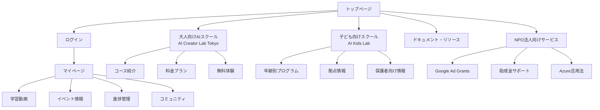
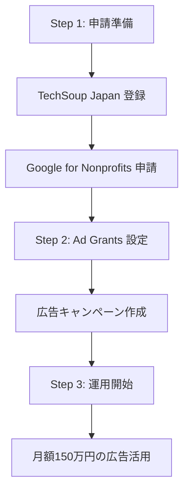
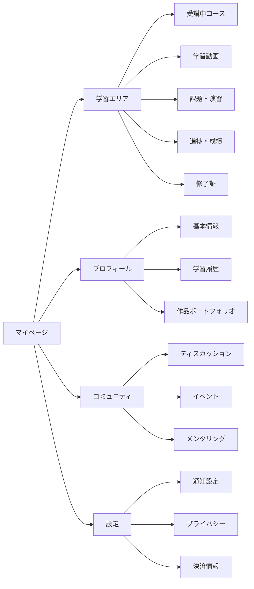
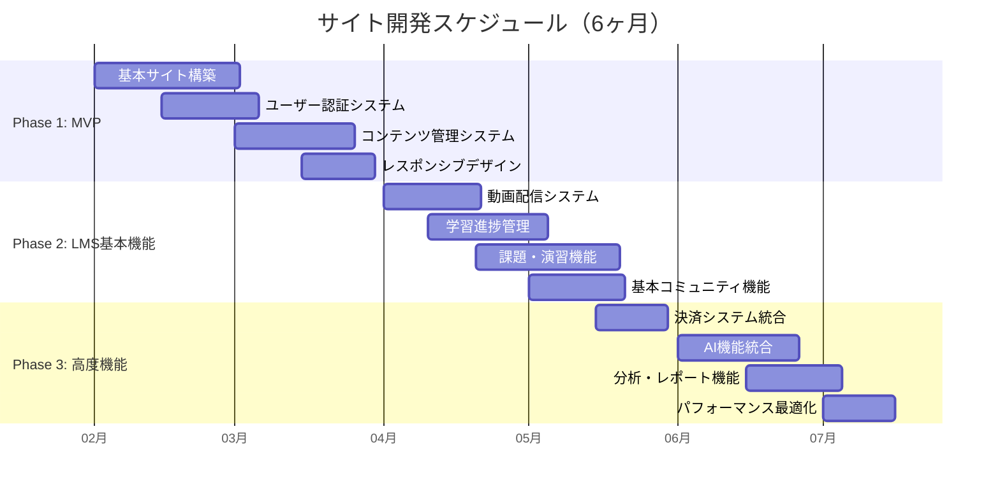
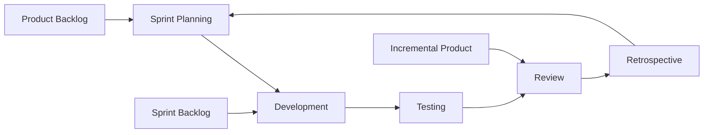
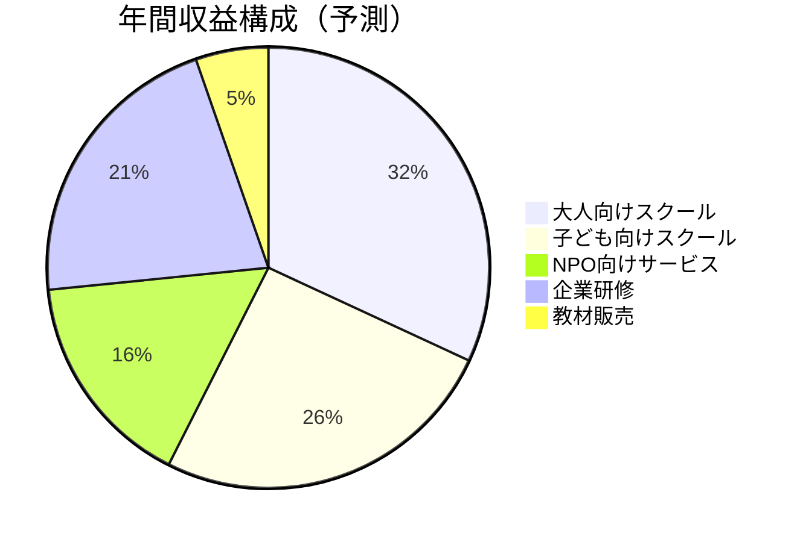

# AI Creator Lab 総合事業サイト 構成設計書

## 📋 目次

1. [プロジェクト概要](#プロジェクト概要)
2. [サイト全体構成](#サイト全体構成)
3. [パブリックエリア詳細](#パブリックエリア詳細)
4. [学習管理システム（LMS）](#学習管理システムlms)
5. [技術スタック](#技術スタック)
6. [開発計画](#開発計画)
7. [コスト・リソース](#コストリソース)

---

## プロジェクト概要

### 🎯 プロジェクト目標
3つの事業（大人向けAIスクール、子ども向けデジタル創造スクール、NPO向けサービス）を統合した総合プラットフォームを構築し、ユーザーが学習・成長できる環境を提供する。

### 🌟 主要機能
- **事業紹介・申込**: 各事業の詳細情報と申込システム
- **学習管理**: 動画視聴、課題提出、進捗管理
- **コミュニティ**: 受講生・講師間の交流
- **ドキュメント**: 技術資料・ガイドライン
- **イベント管理**: セミナー・体験会の告知・予約

---

## サイト全体構成

### 🗺️ サイトマップ



### 📁 ディレクトリ構造

```
/
├── /adult-school/              # 大人向けAIスクール
│   ├── /courses/              # コース一覧
│   ├── /pricing/              # 料金プラン
│   ├── /instructors/          # 講師紹介
│   ├── /trial/                # 無料体験
│   └── /testimonials/         # 受講生の声
├── /kids-lab/                 # 子ども向けスクール
│   ├── /programs/             # 年齢別プログラム
│   ├── /locations/            # 拠点・アクセス
│   ├── /pricing/              # 料金・支援制度
│   ├── /parents/              # 保護者向け情報
│   └── /gallery/              # 作品ギャラリー
├── /npo-services/             # NPO法人向けサービス
│   ├── /google-grants/        # Google Ad Grants
│   ├── /funding-database/     # 助成金データベース
│   ├── /azure-guide/          # Azure活用ガイド
│   ├── /case-studies/         # 成功事例
│   └── /consultation/         # 無料相談
├── /docs/                     # ドキュメント
│   ├── /getting-started/      # はじめに
│   ├── /adult-school/         # 大人向けガイド
│   ├── /kids-lab/             # 子ども向けガイド
│   ├── /npo-guide/            # NPO向けガイド
│   └── /api/                  # API・開発者向け
├── /login/                    # ログイン
├── /dashboard/                # マイページ
│   ├── /learning/             # 学習エリア
│   ├── /profile/              # プロフィール
│   ├── /community/            # コミュニティ
│   └── /settings/             # 設定
├── /events/                   # イベント
├── /blog/                     # ブログ
├── /about/                    # 会社概要
└── /contact/                  # お問い合わせ
```

---

## パブリックエリア詳細

### 🏠 トップページ

#### ページ構成
```html
<!DOCTYPE html>
<html>
<head>
    <!-- SEO最適化 -->
    <title>AI Creator Lab - AIで未来を創る学びの場</title>
    <meta name="description" content="大人向けAIスクール、子ども向けデジタル創造スクール、NPO向けサービスを提供">
</head>
<body>
    <!-- ヘッダー -->
    <header>
        <nav>
            <logo>AI Creator Lab</logo>
            <menu>
                <item>大人向けスクール</item>
                <item>子ども向けスクール</item>
                <item>NPO向けサービス</item>
                <item>ドキュメント</item>
                <item>お問い合わせ</item>
                <item>ログイン</item>
            </menu>
        </nav>
    </header>

    <!-- メインコンテンツ -->
    <main>
        <!-- ヒーローセクション -->
        <section class="hero">
            <h1>AIで未来を創る学びの場</h1>
            <p>すべての人にAI時代を生き抜く力を</p>
            <cta-buttons>
                <button>無料体験申込</button>
                <button>資料ダウンロード</button>
            </cta-buttons>
        </section>

        <!-- 3つの事業紹介 -->
        <section class="services">
            <service-card>
                <title>大人向けAIスクール</title>
                <description>仕事で使えるAIスキルを3日で習得</description>
                <link>詳細を見る</link>
            </service-card>
            <service-card>
                <title>子ども向けスクール</title>
                <description>遊びながら学ぶデジタル創造</description>
                <link>詳細を見る</link>
            </service-card>
            <service-card>
                <title>NPO向けサービス</title>
                <description>Google Ad Grants等の活用支援</description>
                <link>詳細を見る</link>
            </service-card>
        </section>

        <!-- 特徴・強み -->
        <section class="features">
            <!-- 実績、教育方針、サポート体制等 -->
        </section>

        <!-- 利用者の声 -->
        <section class="testimonials">
            <!-- レビュー、成果事例 -->
        </section>

        <!-- 最新情報 -->
        <section class="news">
            <!-- ブログ、イベント情報 -->
        </section>
    </main>

    <!-- フッター -->
    <footer>
        <!-- 各事業へのリンク、SNS、法的情報 -->
    </footer>
</body>
</html>
```

### 🎓 大人向けAIスクールページ

#### 主要ページと機能

| ページ | URL | 主要コンテンツ | 機能 |
|--------|-----|----------------|------|
| **コース一覧** | `/adult-school/courses/` | 3日間集中講座、実践コース等 | フィルタリング、比較表、詳細ページ |
| **料金プラン** | `/adult-school/pricing/` | 価格表、特典、支払方法 | 料金計算機、申込ボタン、FAQ |
| **講師紹介** | `/adult-school/instructors/` | プロフィール、専門分野、経歴 | 講師詳細ページ、スケジュール |
| **カリキュラム** | `/adult-school/courses/[slug]/` | 学習内容、スケジュール、目標 | 展開可能なアコーディオン |
| **無料体験** | `/adult-school/trial/` | 申込フォーム、日程選択 | カレンダー予約システム |
| **受講生の声** | `/adult-school/testimonials/` | レビュー、成果事例、転職実績 | フィルタリング、評価システム |

#### コース詳細ページ構成
```markdown
# ChatGPT/Claude 仕事効率化 3日間集中講座

## 📊 コース概要
- **受講期間**: 3日間（各2時間）
- **受講料**: 29,800円
- **定員**: 20名
- **形式**: オンライン（Zoom）

## 📚 カリキュラム

### Day 1: AI基礎編
| 時間 | 内容 | 演習 |
|------|------|------|
| 30分 | AIの仕組みと可能性 | - |
| 30分 | アカウント作成・設定 | 実際に登録 |
| 30分 | 基本操作とプロンプト | 簡単な質問投稿 |
| 30分 | 実習・質疑応答 | 自分の業務で試行 |

### Day 2: 実践編
- 文書作成自動化
- データ分析
- 画像生成連携

### Day 3: 応用編
- カスタムGPT作成
- API連携基礎
- 業務適用計画

## 🎯 学習目標
- [ ] AIツールの基本操作をマスター
- [ ] 業務効率化のプロンプトを作成
- [ ] 実際の業務に適用

## 👨‍🏫 担当講師
[講師プロフィール]

## 💰 料金・特典
- **早期申込割引**: 25,800円
- **学生割引**: 19,800円
- **修了証**: デジタル発行

## 📅 次回開催日程
[カレンダー表示]

## 🔗 関連コース
- AI活用実践コース
- プロンプトエンジニアリング上級
```

### 👶 子ども向けスクールページ

#### 主要ページと機能

| ページ | URL | 主要コンテンツ | 機能 |
|--------|-----|----------------|------|
| **年齢別プログラム** | `/kids-lab/programs/` | ビギナー・ジュニア・アドバンス | 年齢選択タブ、詳細表示 |
| **拠点・アクセス** | `/kids-lab/locations/` | 公民館情報、オンライン環境 | 地図、交通案内、空き状況 |
| **料金・支援制度** | `/kids-lab/pricing/` | スライディングスケール | 料金シミュレーター |
| **保護者向け情報** | `/kids-lab/parents/` | 安全対策、教育理念、FAQ | 相談窓口、資料DL |
| **作品ギャラリー** | `/kids-lab/gallery/` | 子どもたちの制作物 | 画像・動画ギャラリー |
| **イベント・発表会** | `/kids-lab/events/` | 季節イベント、成果発表 | イベントカレンダー |

#### 年齢別プログラム表示例
```html
<div class="age-programs">
    <!-- タブ切り替え -->
    <tabs>
        <tab active>ビギナー（小1-3）</tab>
        <tab>ジュニア（小4-6）</tab>
        <tab>アドバンス（中高生）</tab>
    </tabs>

    <!-- ビギナーコース詳細 -->
    <tab-content id="beginner">
        <h2>🐣 ビギナーコース（小学1-3年生）</h2>
        
        <weekly-schedule>
            <day>
                <title>月曜日 - AIとあそぼう</title>
                <time>16:00-17:00</time>
                <activities>
                    <item>ChatGPTで物語づくり</item>
                    <item>AI画像生成でキャラクター作成</item>
                    <item>音声AIで歌を作ろう</item>
                </activities>
            </day>
            <!-- 他の曜日も同様 -->
        </weekly-schedule>

        <features>
            <feature>
                <icon>🎮</icon>
                <title>遊びながら学習</title>
                <description>ゲーム感覚で楽しく</description>
            </feature>
            <feature>
                <icon>👥</icon>
                <title>少人数制</title>
                <description>一人ひとりに丁寧指導</description>
            </feature>
        </features>

        <cta>
            <button>無料体験申込</button>
            <button>資料請求</button>
        </cta>
    </tab-content>
</div>
```

### 🏢 NPO法人向けサービスページ

#### 主要ページと機能

| ページ | URL | 主要コンテンツ | 機能 |
|--------|-----|----------------|------|
| **Google Ad Grants** | `/npo-services/google-grants/` | 申請手順、活用事例 | ステップガイド、申請支援 |
| **助成金データベース** | `/npo-services/funding-database/` | 検索可能な助成金情報 | 検索・フィルタ機能 |
| **Azure活用ガイド** | `/npo-services/azure-guide/` | 技術的実装方法 | コード例、チュートリアル |
| **成功事例** | `/npo-services/case-studies/` | 他団体の実績、ROI | ケーススタディ |
| **無料相談** | `/npo-services/consultation/` | 個別サポート申込 | 相談予約システム |

#### Google Ad Grants ページ構成
```markdown
# Google Ad Grants 完全攻略ガイド

## 💰 基本情報
- **月額広告費**: $10,000（約150万円）無料
- **年間**: 1,800万円分の広告が無料
- **対象**: 認定NPO法人

## 🚀 申請から運用までのステップ



## 📋 申請準備チェックリスト
- [ ] NPO法人の登記簿謄本（3ヶ月以内）
- [ ] 定款のコピー
- [ ] 事業報告書
- [ ] 役員名簿
- [ ] 団体のWebサイトURL

## 🎯 高価値キーワード戦略
| キーワード | 月間検索数 | 適用分野 |
|------------|------------|----------|
| "生成AI 学習" | 8,100回 | メインターゲット |
| "ChatGPT 使い方" | 27,100回 | 初心者向け |
| "AI 副業" | 4,400回 | 収益化関心層 |

## 📞 無料相談のお申込み
[相談フォーム]
```

---

## 学習管理システム（LMS）

### 🔐 ログイン後エリア

#### マイページダッシュボード構成



### 📚 学習管理機能詳細

#### 動画視聴システム
```typescript
interface VideoPlayer {
  // 基本機能
  playback: {
    play: () => void;
    pause: () => void;
    seek: (time: number) => void;
    setSpeed: (speed: number) => void; // 0.5x, 1x, 1.25x, 1.5x, 2x
  };
  
  // 進捗管理
  progress: {
    currentTime: number;
    duration: number;
    watchedPercentage: number;
    lastWatchedAt: Date;
  };
  
  // インタラクティブ機能
  interactive: {
    bookmarks: Bookmark[];
    notes: Note[];
    quiz: Quiz[];
    subtitles: boolean;
  };
  
  // 品質制御
  quality: {
    resolution: '360p' | '720p' | '1080p';
    autoQuality: boolean;
    bandwidth: number;
  };
}

interface LearningProgress {
  courseId: string;
  userId: string;
  completedLessons: string[];
  totalLessons: number;
  progressPercentage: number;
  timeSpent: number; // 分
  lastAccessedAt: Date;
  certificateEarned: boolean;
}
```

#### 課題・演習システム
```typescript
interface Assignment {
  id: string;
  title: string;
  description: string;
  type: 'code' | 'essay' | 'quiz' | 'project';
  dueDate: Date;
  maxScore: number;
  
  // コード課題の場合
  codeTemplate?: string;
  language?: 'javascript' | 'python' | 'html';
  testCases?: TestCase[];
  
  // 提出物
  submissions: Submission[];
  
  // AI支援
  aiHints: boolean;
  autoGrading: boolean;
}

interface CodeExecutionEnvironment {
  // ブラウザ内コード実行
  languages: ['javascript', 'python', 'html', 'css'];
  
  // AI API体験環境
  apiAccess: {
    openai: boolean;
    anthropic: boolean;
    quota: number; // 1日あたりの利用制限
  };
  
  // 協調作業
  collaboration: {
    liveShare: boolean;
    peerReview: boolean;
    mentorSupport: boolean;
  };
}
```

### 🎯 学習機能マトリックス

| 機能 | 大人向け | 子ども向け | NPO向け | 実装優先度 |
|------|----------|------------|---------|------------|
| **動画視聴** | ✓ | ✓ | ✓ | 高 |
| **進捗保存** | ✓ | ✓ | ✓ | 高 |
| **倍速再生** | ✓ | △ | ✓ | 中 |
| **字幕表示** | ✓ | ✓ | ✓ | 中 |
| **課題提出** | ✓ | ✓ | - | 高 |
| **コード実行** | ✓ | ✓ | - | 中 |
| **AI API体験** | ✓ | △ | ✓ | 高 |
| **ライブ配信** | ✓ | ✓ | ✓ | 低 |
| **グループワーク** | ✓ | ✓ | - | 低 |
| **作品共有** | ✓ | ✓ | - | 中 |
| **修了証発行** | ✓ | ✓ | - | 中 |
| **保護者通知** | - | ✓ | - | 中 |

### 👥 コミュニティ機能

#### ディスカッションボード
```html
<!-- フォーラム構成 -->
<forum>
    <categories>
        <category>質問・相談</category>
        <category>作品共有</category>
        <category>技術情報</category>
        <category>雑談</category>
        <category>講師からのお知らせ</category>
    </categories>
    
    <thread>
        <title>ChatGPTのプロンプトがうまくいかない</title>
        <author>受講生A</author>
        <timestamp>2024-01-15 14:30</timestamp>
        <content>...</content>
        <replies>
            <reply author="講師B">...</reply>
            <reply author="受講生C">...</reply>
        </replies>
        <tags>
            <tag>ChatGPT</tag>
            <tag>プロンプト</tag>
            <tag>初心者</tag>
        </tags>
    </thread>
</forum>
```

#### イベント・セミナー管理
```typescript
interface Event {
  id: string;
  title: string;
  description: string;
  type: 'webinar' | 'workshop' | 'networking' | 'presentation';
  
  schedule: {
    startTime: Date;
    endTime: Date;
    timezone: string;
    recurring?: 'weekly' | 'monthly';
  };
  
  access: {
    memberOnly: boolean;
    maxParticipants: number;
    registrationRequired: boolean;
    fee?: number;
  };
  
  platform: {
    type: 'zoom' | 'teams' | 'youtube';
    meetingId?: string;
    passcode?: string;
    streamUrl?: string;
  };
  
  materials: {
    presentation?: string;
    handouts?: string[];
    recording?: string;
  };
}
```

---

## 技術スタック

### 🖥️ フロントエンド

#### 主要技術
```json
{
  "framework": "Next.js 14",
  "language": "TypeScript",
  "styling": "Tailwind CSS + shadcn/ui",
  "stateManagement": "Zustand",
  "authentication": "NextAuth.js",
  "forms": "React Hook Form + Zod",
  "animation": "Framer Motion",
  "charts": "Recharts",
  "videoPlayer": "Video.js",
  "codeEditor": "Monaco Editor",
  "richTextEditor": "Tiptap",
  "calendar": "FullCalendar",
  "notifications": "React Hot Toast"
}
```

#### コンポーネント設計
```typescript
// 共通コンポーネント
components/
├── ui/                    // shadcn/ui基本コンポーネント
│   ├── button.tsx
│   ├── input.tsx
│   ├── modal.tsx
│   └── ...
├── layout/               // レイアウトコンポーネント
│   ├── Header.tsx
│   ├── Footer.tsx
│   ├── Sidebar.tsx
│   └── Navigation.tsx
├── learning/             // 学習関連
│   ├── VideoPlayer.tsx
│   ├── CourseCard.tsx
│   ├── ProgressBar.tsx
│   └── QuizComponent.tsx
├── community/            // コミュニティ関連
│   ├── ForumPost.tsx
│   ├── EventCard.tsx
│   └── ChatComponent.tsx
└── forms/               // フォーム関連
    ├── ContactForm.tsx
    ├── RegistrationForm.tsx
    └── PaymentForm.tsx
```

### ⚙️ バックエンド・インフラ

#### Azure活用アーキテクチャ
```yaml
# NPO法人のAzure無料枠活用
infrastructure:
  compute:
    - Azure App Service (B1プラン)
    - Azure Functions (従量課金)
    - Azure Container Instances
  
  storage:
    - Azure Blob Storage (動画・ファイル)
    - Azure SQL Database
    - Azure Redis Cache
  
  delivery:
    - Azure CDN (静的コンテンツ配信)
    - Azure Front Door (WAF付き)
  
  ai_services:
    - Azure OpenAI Service
    - Azure Cognitive Services
    - Azure Bot Service
  
  monitoring:
    - Application Insights
    - Azure Monitor
    - Log Analytics

development:
  runtime: "Node.js 18 / Python 3.11"
  framework: "Next.js API Routes / FastAPI"
  orm: "Prisma / SQLAlchemy"
  queue: "Azure Service Bus"
  cache: "Redis"
  search: "Azure Cognitive Search"
```

#### データベース設計
```sql
-- 主要テーブル構造

-- ユーザー管理
CREATE TABLE users (
    id UUID PRIMARY KEY,
    email VARCHAR(255) UNIQUE NOT NULL,
    password_hash VARCHAR(255),
    role ENUM('student', 'instructor', 'admin'),
    profile_data JSONB,
    created_at TIMESTAMP DEFAULT NOW(),
    updated_at TIMESTAMP DEFAULT NOW()
);

-- コース管理
CREATE TABLE courses (
    id UUID PRIMARY KEY,
    title VARCHAR(255) NOT NULL,
    description TEXT,
    category ENUM('adult', 'kids', 'npo'),
    price DECIMAL(10,2),
    status ENUM('draft', 'published', 'archived'),
    instructor_id UUID REFERENCES users(id),
    created_at TIMESTAMP DEFAULT NOW()
);

-- 学習進捗
CREATE TABLE learning_progress (
    id UUID PRIMARY KEY,
    user_id UUID REFERENCES users(id),
    course_id UUID REFERENCES courses(id),
    lesson_id UUID,
    progress_percentage INTEGER DEFAULT 0,
    time_spent INTEGER DEFAULT 0,
    completed_at TIMESTAMP,
    last_accessed_at TIMESTAMP DEFAULT NOW()
);

-- 動画管理
CREATE TABLE videos (
    id UUID PRIMARY KEY,
    course_id UUID REFERENCES courses(id),
    title VARCHAR(255) NOT NULL,
    description TEXT,
    video_url VARCHAR(500),
    duration INTEGER,
    order_index INTEGER,
    created_at TIMESTAMP DEFAULT NOW()
);

-- 課題・演習
CREATE TABLE assignments (
    id UUID PRIMARY KEY,
    course_id UUID REFERENCES courses(id),
    title VARCHAR(255) NOT NULL,
    description TEXT,
    type ENUM('code', 'essay', 'quiz', 'project'),
    max_score INTEGER DEFAULT 100,
    due_date TIMESTAMP,
    created_at TIMESTAMP DEFAULT NOW()
);

-- 提出物
CREATE TABLE submissions (
    id UUID PRIMARY KEY,
    assignment_id UUID REFERENCES assignments(id),
    user_id UUID REFERENCES users(id),
    content TEXT,
    file_urls TEXT[],
    score INTEGER,
    feedback TEXT,
    submitted_at TIMESTAMP DEFAULT NOW(),
    graded_at TIMESTAMP
);

-- イベント管理
CREATE TABLE events (
    id UUID PRIMARY KEY,
    title VARCHAR(255) NOT NULL,
    description TEXT,
    event_type ENUM('webinar', 'workshop', 'networking'),
    start_time TIMESTAMP NOT NULL,
    end_time TIMESTAMP NOT NULL,
    max_participants INTEGER,
    meeting_url VARCHAR(500),
    created_at TIMESTAMP DEFAULT NOW()
);

-- 決済管理
CREATE TABLE payments (
    id UUID PRIMARY KEY,
    user_id UUID REFERENCES users(id),
    course_id UUID REFERENCES courses(id),
    amount DECIMAL(10,2) NOT NULL,
    currency VARCHAR(3) DEFAULT 'JPY',
    payment_method VARCHAR(50),
    stripe_payment_id VARCHAR(255),
    status ENUM('pending', 'completed', 'failed', 'refunded'),
    created_at TIMESTAMP DEFAULT NOW()
);
```

### 🔗 外部サービス連携

#### 主要API統合
```typescript
// 外部サービス統合
integrations: {
  payment: {
    stripe: {
      api_version: '2023-10-16',
      features: ['subscriptions', 'one-time', 'refunds'],
      webhooks: ['payment_intent.succeeded', 'subscription.updated']
    }
  },
  
  video: {
    azure_media_services: {
      streaming: 'adaptive_bitrate',
      cdn: 'azure_cdn',
      analytics: 'viewer_engagement'
    },
    vimeo: {
      player: 'embedded',
      analytics: 'basic',
      privacy: 'domain_restricted'
    }
  },
  
  communication: {
    zoom: {
      api: 'meetings',
      features: ['create_meeting', 'get_recordings', 'webhooks']
    },
    sendgrid: {
      email: 'transactional',
      templates: ['welcome', 'course_completion', 'reminder']
    }
  },
  
  ai_services: {
    openai: {
      models: ['gpt-4', 'dall-e-3', 'whisper'],
      usage: 'educational_chatbot'
    },
    anthropic: {
      models: ['claude-3'],
      usage: 'content_generation'
    }
  },
  
  analytics: {
    google_analytics: 'GA4',
    microsoft_clarity: 'user_behavior',
    hotjar: 'user_feedback'
  }
}
```

### 📱 レスポンシブ対応

#### ブレークポイント戦略
```css
/* Tailwind CSS カスタム設定 */
module.exports = {
  theme: {
    screens: {
      'xs': '475px',    // 小型スマートフォン
      'sm': '640px',    // スマートフォン
      'md': '768px',    // タブレット（縦）
      'lg': '1024px',   // タブレット（横）、小型ノートPC
      'xl': '1280px',   // ノートPC、デスクトップ
      '2xl': '1536px',  // 大型デスクトップ
      
      // カスタムブレークポイント
      'tablet': '768px',
      'laptop': '1024px',
      'desktop': '1280px'
    }
  }
}
```

#### デバイス別最適化
| デバイス | 画面サイズ | 主要最適化ポイント |
|----------|------------|---------------------|
| **スマートフォン** | ~768px | タッチ操作最適化、縦画面動画、簡潔ナビゲーション |
| **タブレット** | 768px~1024px | 学習に最適な画面サイズ、横画面対応 |
| **ノートPC** | 1024px~1440px | 標準的な学習環境、サイドバー表示 |
| **デスクトップ** | 1440px~ | 多画面表示、高解像度対応、講師ツール |

---

## 開発計画

### 📅 段階的実装スケジュール



### 🎯 Phase別詳細計画

#### Phase 1: MVP（2ヶ月）
**目標**: 基本的な情報発信と申込受付ができるサイト

**主要機能**
- [ ] 静的ページ（トップ、事業紹介、料金、お問い合わせ）
- [ ] ユーザー登録・ログイン機能
- [ ] 簡易CMS（ブログ、お知らせ）
- [ ] レスポンシブデザイン
- [ ] 基本的なSEO対策

**技術スタック**
```typescript
const phase1Stack = {
  frontend: "Next.js 14 + TypeScript",
  styling: "Tailwind CSS",
  database: "SQLite（開発）/ Azure SQL（本番）",
  auth: "NextAuth.js",
  deployment: "Azure App Service",
  cms: "MDX ベース"
}
```

**成果物**
- 基本的なマーケティングサイト
- ユーザー登録フロー
- お問い合わせ・申込フォーム
- 管理者ダッシュボード（基本）

#### Phase 2: LMS基本機能（2ヶ月）
**目標**: 学習管理の基本機能を実装

**主要機能**
- [ ] 動画配信システム
- [ ] 学習進捗トラッキング
- [ ] オンライン課題システム
- [ ] 講師-受講生コミュニケーション
- [ ] イベント・セミナー管理

**技術追加**
```typescript
const phase2Stack = {
  video: "Azure Media Services + Video.js",
  realtime: "Socket.io",
  queue: "Azure Service Bus",
  storage: "Azure Blob Storage",
  cache: "Redis"
}
```

**成果物**
- 完全なLMSダッシュボード
- 動画視聴・進捗管理
- 基本的な課題システム
- イベント管理機能

#### Phase 3: 高度機能（2ヶ月）
**目標**: AI機能とスケーラビリティの実装

**主要機能**
- [ ] AI チャットボット（学習支援）
- [ ] 自動採点システム
- [ ] 高度な分析・レポート
- [ ] モバイルアプリ（PWA）
- [ ] パフォーマンス最適化

**技術追加**
```typescript
const phase3Stack = {
  ai: "Azure OpenAI Service",
  analytics: "Application Insights + Custom Analytics",
  mobile: "PWA + Push Notifications",
  performance: "Azure CDN + Image Optimization",
  monitoring: "Azure Monitor + Alerting"
}
```

### 👥 開発チーム構成

| 役割 | 人数 | スキル要件 | 月額予算 |
|------|------|------------|----------|
| **フルスタック開発者** | 2名 | Next.js, TypeScript, Azure | 80万円×2 |
| **デザイナー** | 1名 | UI/UX, Figma, フロントエンド | 60万円 |
| **プロジェクトマネージャー** | 1名 | アジャイル、教育業界知識 | 70万円 |
| **QA・テスター** | 1名 | 自動テスト、セキュリティ | 50万円 |
| **DevOps エンジニア** | 0.5名 | Azure、CI/CD | 40万円 |

**月額総額**: 380万円
**6ヶ月総額**: 2,280万円

### 🔄 開発プロセス

#### アジャイル開発（2週間スプリント）


#### 品質管理
```typescript
// テスト戦略
const testingStrategy = {
  unit: "Jest + React Testing Library",
  integration: "Playwright",
  e2e: "Cypress",
  performance: "Lighthouse CI",
  security: "OWASP ZAP",
  accessibility: "axe-core",
  
  coverage: {
    target: "80%",
    critical_paths: "95%"
  }
}
```

---

## コスト・リソース

### 💰 開発コスト詳細

#### 内製 vs 外注 比較
| 項目 | 内製コスト | 外注コスト | 推奨アプローチ | 理由 |
|------|------------|------------|----------------|------|
| **基本サイト** | 2ヶ月 | 150万円 | 内製 | ノウハウ蓄積、長期保守 |
| **LMS機能** | 3ヶ月 | 300万円 | 内製+既存ツール活用 | 教育特化のカスタマイズ |
| **デザインシステム** | 1ヶ月 | 80万円 | 外注 | 専門性、短期間での完成 |
| **AI機能** | 1ヶ月 | 100万円 | 内製 | Azure無料枠活用 |
| **モバイルアプリ** | 2ヶ月 | 200万円 | PWA（内製） | コスト削減、統一保守 |

#### 年間運用コスト
| 項目 | 月額 | 年額 | 備考 |
|------|------|------|------|
| **インフラ（Azure）** | 10万円 | 120万円 | NPO割引適用後 |
| **外部サービス** | 5万円 | 60万円 | Stripe, SendGrid等 |
| **ドメイン・SSL** | 1万円 | 12万円 |  |
| **サポート・保守** | 15万円 | 180万円 | 月2日程度 |
| **セキュリティ監査** | - | 50万円 | 年1回 |
| **合計** | **31万円** | **422万円** |  |

### 📊 ROI・効果測定

#### NPO法人としてのコスト削減効果
| 項目 | 通常コスト | NPO割引後 | 年間削減額 |
|------|------------|------------|------------|
| **Azure インフラ** | 月50万円 | 月10万円 | 480万円 |
| **Google Ad Grants** | 月150万円 | 無料 | 1,800万円 |
| **Microsoft 365** | 月15万円 | 月3万円 | 144万円 |
| **開発ツール** | 月10万円 | 月2万円 | 96万円 |
| **合計削減額** | - | - | **2,520万円** |

#### 事業収益予測


### 🎯 成功指標（KPI）

#### 技術指標
| 指標 | 目標値 | 測定方法 |
|------|--------|----------|
| **ページ読み込み時間** | <3秒 | Lighthouse |
| **アップタイム** | 99.9% | Azure Monitor |
| **セキュリティスコア** | A+ | OWASP ZAP |
| **アクセシビリティ** | AAA準拠 | axe-core |
| **モバイル対応** | 100点 | Google PageSpeed |

#### ビジネス指標
| 指標 | 3ヶ月 | 6ヶ月 | 1年後 |
|------|-------|-------|-------|
| **月間アクティブユーザー** | 500名 | 1,500名 | 3,000名 |
| **コース完了率** | 70% | 80% | 85% |
| **顧客満足度** | 4.0/5 | 4.3/5 | 4.5/5 |
| **月間売上** | 300万円 | 800万円 | 1,500万円 |
| **新規登録数** | 月200名 | 月500名 | 月800名 |

### 🛡️ リスク管理

#### 技術リスク
| リスク | 影響度 | 対策 |
|--------|--------|------|
| **Azure障害** | 高 | マルチリージョン構成、バックアップ |
| **セキュリティ侵害** | 高 | 定期監査、WAF、暗号化 |
| **スケーラビリティ** | 中 | 自動スケーリング設定 |
| **データ消失** | 高 | 日次バックアップ、地理冗長 |

#### ビジネスリスク
| リスク | 影響度 | 対策 |
|--------|--------|------|
| **競合参入** | 中 | 差別化機能、コミュニティ強化 |
| **法規制変更** | 中 | 法務相談、プライバシー対応 |
| **講師不足** | 高 | 講師育成プログラム、外部連携 |
| **技術変化** | 中 | 技術トレンド追跡、柔軟なアーキテクチャ |

---

## 📝 まとめ

この設計書では、3つの事業を統合した総合プラットフォームの構築計画を詳細に策定しました。

### 🌟 主要ポイント

1. **統合プラットフォーム**: 大人向け・子ども向け・NPO向けサービスを一元化
2. **NPO優位性活用**: Azure無料枠とGoogle Ad Grantsで年間2,520万円のコスト削減
3. **スケーラブル設計**: 段階的実装で初期投資を抑制
4. **教育特化LMS**: 動画学習、進捗管理、AI支援機能を統合

### 🚀 次のステップ

1. **Phase 1 開発開始**: 基本サイト構築（2ヶ月）
2. **デザインシステム策定**: UI/UXの統一
3. **技術検証**: Azure環境での実装テスト
4. **チーム編成**: 開発リソースの確保

NPO法人の特典を最大活用することで、高品質なプラットフォームを低コストで実現できる計画となっています。

どの部分から着手するか、ご相談ください！🎯