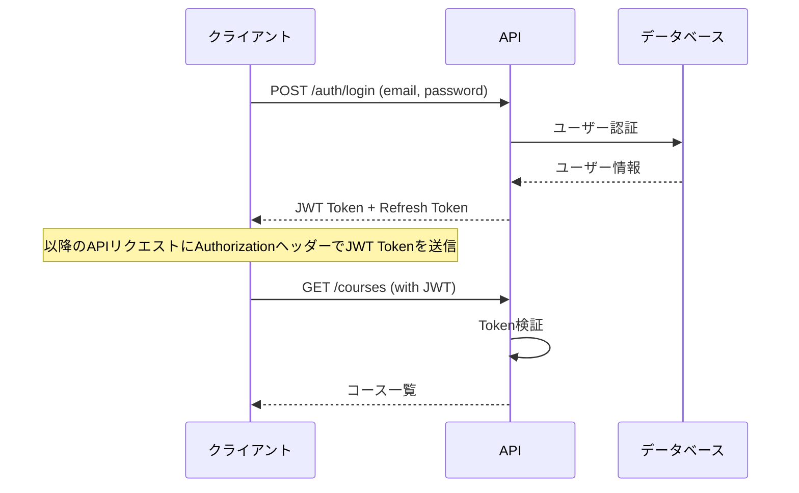

# API仕様書

AI Creator Lab E-Schoolプラットフォームの将来的なAPI実装のための仕様書です。

## 📋 目次

1. [API概要](#api概要)
2. [認証・認可](#認証認可)
3. [共通仕様](#共通仕様)
4. [エンドポイント一覧](#エンドポイント一覧)
5. [データモデル](#データモデル)
6. [エラーハンドリング](#エラーハンドリング)
7. [実装例](#実装例)

---

## 🔍 API概要

### ベースURL
- **開発環境**: `http://localhost:3000/api`
- **本番環境**: `https://ai-creator-lab.com/api`

### APIバージョン
- **現在のバージョン**: v1
- **パス**: `/api/v1/`

### サポート形式
- **リクエスト**: JSON
- **レスポンス**: JSON
- **文字エンコーディング**: UTF-8

---

## 🔐 認証・認可

### 認証方式
JWT（JSON Web Token）ベースの認証を使用

### 認証フロー


### ヘッダー設定
```http
Authorization: Bearer <JWT_TOKEN>
Content-Type: application/json
```

---

## 📝 共通仕様

### HTTPステータスコード
| コード | 意味 | 使用場面 |
|--------|------|----------|
| 200 | OK | 正常なレスポンス |
| 201 | Created | リソース作成成功 |
| 400 | Bad Request | リクエストエラー |
| 401 | Unauthorized | 認証エラー |
| 403 | Forbidden | 認可エラー |
| 404 | Not Found | リソースが見つからない |
| 422 | Unprocessable Entity | バリデーションエラー |
| 500 | Internal Server Error | サーバーエラー |

### 共通レスポンス形式
```json
{
  \"success\": true,
  \"data\": {},
  \"message\": \"Success\",
  \"timestamp\": \"2024-01-01T00:00:00.000Z\",
  \"version\": \"v1\"
}
```

### エラーレスポンス形式
```json
{
  \"success\": false,
  \"error\": {
    \"code\": \"VALIDATION_ERROR\",
    \"message\": \"Invalid input data\",
    \"details\": [
      {
        \"field\": \"email\",
        \"message\": \"Invalid email format\"
      }
    ]
  },
  \"timestamp\": \"2024-01-01T00:00:00.000Z\",
  \"version\": \"v1\"
}
```

---

## 🛣️ エンドポイント一覧

### 認証関連

#### POST /api/v1/auth/login
ユーザーログイン

**リクエスト**:
```json
{
  \"email\": \"user@example.com\",
  \"password\": \"password123\"
}
```

**レスポンス**:
```json
{
  \"success\": true,
  \"data\": {
    \"user\": {
      \"id\": \"user_123\",
      \"email\": \"user@example.com\",
      \"name\": \"田中太郎\",
      \"role\": \"student\"
    },
    \"accessToken\": \"eyJhbGciOiJIUzI1NiIsInR5cCI6IkpXVCJ9...\",
    \"refreshToken\": \"refresh_token_here\",
    \"expiresIn\": 3600
  }
}
```

#### POST /api/v1/auth/register
ユーザー登録

**リクエスト**:
```json
{
  \"email\": \"user@example.com\",
  \"password\": \"password123\",
  \"name\": \"田中太郎\",
  \"role\": \"student\",
  \"age\": 25,
  \"interests\": [\"AI\", \"programming\"]
}
```

#### POST /api/v1/auth/refresh
トークンリフレッシュ

**リクエスト**:
```json
{
  \"refreshToken\": \"refresh_token_here\"
}
```

#### POST /api/v1/auth/logout
ログアウト

---

### ユーザー管理

#### GET /api/v1/users/profile
現在のユーザー情報取得

**レスポンス**:
```json
{
  \"success\": true,
  \"data\": {
    \"id\": \"user_123\",
    \"email\": \"user@example.com\",
    \"name\": \"田中太郎\",
    \"role\": \"student\",
    \"profile\": {
      \"age\": 25,
      \"interests\": [\"AI\", \"programming\"],
      \"level\": \"beginner\",
      \"enrolledCourses\": [\"course_1\", \"course_2\"]
    },
    \"createdAt\": \"2024-01-01T00:00:00.000Z\",
    \"updatedAt\": \"2024-01-01T00:00:00.000Z\"
  }
}
```

#### PUT /api/v1/users/profile
ユーザー情報更新

**リクエスト**:
```json
{
  \"name\": \"田中次郎\",
  \"profile\": {
    \"interests\": [\"AI\", \"machine-learning\", \"web-development\"]
  }
}
```

---

### コース管理

#### GET /api/v1/courses
コース一覧取得

**クエリパラメータ**:
- `category`: カテゴリフィルター（adult, kids, corporate）
- `level`: レベルフィルター（beginner, intermediate, advanced）
- `page`: ページ番号（デフォルト: 1）
- `limit`: 件数（デフォルト: 20）

**レスポンス**:
```json
{
  \"success\": true,
  \"data\": {
    \"courses\": [
      {
        \"id\": \"course_1\",
        \"title\": \"ChatGPT/Claude 仕事効率化 3日間集中講座\",
        \"description\": \"実務で即戦力となるAIスキルを短期間で習得\",
        \"category\": \"adult\",
        \"level\": \"beginner\",
        \"duration\": \"3日間\",
        \"price\": 49800,
        \"instructor\": {
          \"id\": \"instructor_1\",
          \"name\": \"山田先生\",
          \"avatar\": \"/images/instructors/yamada.jpg\"
        },
        \"curriculum\": [
          {
            \"day\": 1,
            \"title\": \"AI基礎・導入編\",
            \"duration\": \"2時間\",
            \"topics\": [\"AIの仕組み\", \"アカウント作成\", \"基本操作\"]
          }
        ],
        \"schedule\": {
          \"nextStartDate\": \"2024-02-01\",
          \"availableSlots\": 15
        },
        \"reviews\": {
          \"average\": 4.8,
          \"count\": 124
        }
      }
    ],
    \"pagination\": {
      \"currentPage\": 1,
      \"totalPages\": 5,
      \"totalItems\": 98,
      \"limit\": 20
    }
  }
}
```

#### GET /api/v1/courses/:id
特定コース詳細取得

#### POST /api/v1/courses/:id/enroll
コース申し込み

**リクエスト**:
```json
{
  \"paymentMethod\": \"stripe\",
  \"discountCode\": \"EARLY_BIRD\",
  \"preferences\": {
    \"schedule\": \"morning\",
    \"notifications\": true
  }
}
```

---

### 学習進捗管理

#### GET /api/v1/learning/progress
学習進捗取得

**レスポンス**:
```json
{
  \"success\": true,
  \"data\": {
    \"courses\": [
      {
        \"courseId\": \"course_1\",
        \"title\": \"ChatGPT活用講座\",
        \"progress\": {
          \"completedLessons\": 5,
          \"totalLessons\": 8,
          \"completionRate\": 62.5,
          \"currentLesson\": {
            \"id\": \"lesson_6\",
            \"title\": \"プロンプトエンジニアリング応用\",
            \"estimatedTime\": \"45分\"
          }
        },
        \"lastAccessed\": \"2024-01-15T14:30:00.000Z\"
      }
    ],
    \"overall\": {
      \"totalCoursesEnrolled\": 3,
      \"totalCoursesCompleted\": 1,
      \"totalLearningTime\": \"24時間30分\",
      \"certificates\": 2
    }
  }
}
```

#### POST /api/v1/learning/lessons/:id/complete
レッスン完了記録

**リクエスト**:
```json
{
  \"timeSpent\": 45,
  \"quiz\": {
    \"score\": 85,
    \"answers\": [
      {\"questionId\": \"q1\", \"answer\": \"A\"},
      {\"questionId\": \"q2\", \"answer\": \"B\"}
    ]
  },
  \"feedback\": \"とても分かりやすかったです\"
}
```

---

### 支払い・決済

#### POST /api/v1/payments/create-intent
支払いインテント作成（Stripe連携）

**リクエスト**:
```json
{
  \"courseId\": \"course_1\",
  \"amount\": 49800,
  \"currency\": \"jpy\",
  \"paymentMethod\": \"card\",
  \"discountCode\": \"EARLY_BIRD\"
}
```

#### GET /api/v1/payments/history
支払い履歴取得

---

### コンテンツ管理（管理者用）

#### GET /api/v1/admin/courses
コース管理（管理者）

#### POST /api/v1/admin/courses
新規コース作成（管理者）

#### PUT /api/v1/admin/courses/:id
コース更新（管理者）

#### DELETE /api/v1/admin/courses/:id
コース削除（管理者）

---

## 📊 データモデル

### User（ユーザー）
```typescript
interface User {
  id: string
  email: string
  name: string
  role: 'student' | 'instructor' | 'admin'
  profile: {
    age?: number
    interests: string[]
    level: 'beginner' | 'intermediate' | 'advanced'
    avatar?: string
    bio?: string
  }
  enrolledCourses: string[]
  createdAt: Date
  updatedAt: Date
}
```

### Course（コース）
```typescript
interface Course {
  id: string
  title: string
  description: string
  category: 'adult' | 'kids' | 'corporate'
  level: 'beginner' | 'intermediate' | 'advanced'
  duration: string
  price: number
  instructorId: string
  curriculum: Lesson[]
  schedule: {
    startDate: Date
    endDate: Date
    sessions: Session[]
  }
  maxStudents: number
  currentStudents: number
  isActive: boolean
  createdAt: Date
  updatedAt: Date
}
```

### Lesson（レッスン）
```typescript
interface Lesson {
  id: string
  courseId: string
  title: string
  description: string
  content: {
    type: 'video' | 'text' | 'interactive'
    data: any
  }
  duration: number // minutes
  order: number
  prerequisites: string[]
  quiz?: Quiz
  resources: Resource[]
}
```

### Enrollment（受講申込）
```typescript
interface Enrollment {
  id: string
  userId: string
  courseId: string
  status: 'active' | 'completed' | 'cancelled'
  progress: {
    completedLessons: string[]
    currentLesson: string
    completionRate: number
    totalTimeSpent: number // minutes
  }
  payment: {
    amount: number
    status: 'pending' | 'completed' | 'failed'
    transactionId: string
  }
  enrolledAt: Date
  completedAt?: Date
}
```

---

## ⚠️ エラーハンドリング

### エラーコード一覧

| コード | HTTP状態 | 説明 |
|--------|----------|------|
| `AUTH_REQUIRED` | 401 | 認証が必要 |
| `INVALID_TOKEN` | 401 | トークンが無効 |
| `TOKEN_EXPIRED` | 401 | トークンの有効期限切れ |
| `INSUFFICIENT_PERMISSIONS` | 403 | 権限不足 |
| `USER_NOT_FOUND` | 404 | ユーザーが見つからない |
| `COURSE_NOT_FOUND` | 404 | コースが見つからない |
| `VALIDATION_ERROR` | 422 | 入力値エラー |
| `COURSE_FULL` | 422 | コースが満席 |
| `PAYMENT_FAILED` | 422 | 支払い失敗 |
| `INTERNAL_ERROR` | 500 | サーバー内部エラー |

### エラーハンドリング例
```typescript
// Next.js API Route例
export async function POST(request: Request) {
  try {
    const body = await request.json()
    
    // バリデーション
    if (!body.email || !body.password) {
      return NextResponse.json({
        success: false,
        error: {
          code: 'VALIDATION_ERROR',
          message: 'Email and password are required',
          details: [
            { field: 'email', message: 'Email is required' },
            { field: 'password', message: 'Password is required' }
          ]
        }
      }, { status: 422 })
    }
    
    // 認証処理
    const user = await authenticateUser(body.email, body.password)
    
    if (!user) {
      return NextResponse.json({
        success: false,
        error: {
          code: 'INVALID_CREDENTIALS',
          message: 'Invalid email or password'
        }
      }, { status: 401 })
    }
    
    // 成功レスポンス
    return NextResponse.json({
      success: true,
      data: {
        user,
        accessToken: generateToken(user),
        expiresIn: 3600
      }
    })
    
  } catch (error) {
    console.error('Login error:', error)
    return NextResponse.json({
      success: false,
      error: {
        code: 'INTERNAL_ERROR',
        message: 'An unexpected error occurred'
      }
    }, { status: 500 })
  }
}
```

---

## 💻 実装例

### API Client（フロントエンド）
```typescript
// lib/api-client.ts
class ApiClient {
  private baseUrl: string
  private token?: string

  constructor(baseUrl: string) {
    this.baseUrl = baseUrl
  }

  setToken(token: string) {
    this.token = token
  }

  private async request<T>(
    endpoint: string, 
    options: RequestInit = {}
  ): Promise<T> {
    const url = `${this.baseUrl}${endpoint}`
    
    const headers: Record<string, string> = {
      'Content-Type': 'application/json',
      ...options.headers as Record<string, string>
    }
    
    if (this.token) {
      headers.Authorization = `Bearer ${this.token}`
    }
    
    const response = await fetch(url, {
      ...options,
      headers
    })
    
    if (!response.ok) {
      const error = await response.json()
      throw new ApiError(error.error.code, error.error.message)
    }
    
    const data = await response.json()
    return data.data
  }

  async login(email: string, password: string) {
    return this.request<LoginResponse>('/auth/login', {
      method: 'POST',
      body: JSON.stringify({ email, password })
    })
  }

  async getCourses(params?: GetCoursesParams) {
    const queryString = params ? new URLSearchParams(params).toString() : ''
    return this.request<CoursesResponse>(`/courses?${queryString}`)
  }

  async enrollCourse(courseId: string, data: EnrollmentData) {
    return this.request<EnrollmentResponse>(`/courses/${courseId}/enroll`, {
      method: 'POST',
      body: JSON.stringify(data)
    })
  }
}

export const apiClient = new ApiClient(process.env.NEXT_PUBLIC_API_URL!)
```

### React Hook例
```typescript
// hooks/use-courses.ts
import { useQuery } from '@tanstack/react-query'
import { apiClient } from '@/lib/api-client'

export function useCourses(params?: GetCoursesParams) {
  return useQuery({
    queryKey: ['courses', params],
    queryFn: () => apiClient.getCourses(params),
    staleTime: 5 * 60 * 1000, // 5分
  })
}

export function useCourse(courseId: string) {
  return useQuery({
    queryKey: ['course', courseId],
    queryFn: () => apiClient.getCourse(courseId),
    enabled: !!courseId,
  })
}
```

---

## 🔒 セキュリティ考慮事項

### JWT設定
```typescript
// lib/auth.ts
import jwt from 'jsonwebtoken'

export function generateToken(user: User): string {
  return jwt.sign(
    { 
      userId: user.id, 
      email: user.email,
      role: user.role 
    },
    process.env.JWT_SECRET!,
    { 
      expiresIn: '1h',
      issuer: 'ai-creator-lab',
      audience: 'ai-creator-lab-users'
    }
  )
}

export function verifyToken(token: string): TokenPayload {
  return jwt.verify(token, process.env.JWT_SECRET!) as TokenPayload
}
```

### レート制限
```typescript
// middleware/rate-limit.ts
import rateLimit from 'express-rate-limit'

export const authLimiter = rateLimit({
  windowMs: 15 * 60 * 1000, // 15分
  max: 5, // 最大5回の試行
  message: {
    success: false,
    error: {
      code: 'RATE_LIMIT_EXCEEDED',
      message: 'Too many login attempts, please try again later'
    }
  }
})
```

---

## 🚀 今後の実装予定

### Phase 1（基本機能）
- [ ] ユーザー認証・認可
- [ ] コース管理
- [ ] 受講申込・決済
- [ ] 基本的な学習進捗

### Phase 2（拡張機能）
- [ ] リアルタイム通知
- [ ] ビデオ会議統合
- [ ] クイズ・テスト機能
- [ ] 証明書発行

### Phase 3（高度な機能）
- [ ] AI推奨システム
- [ ] コミュニティ機能
- [ ] ライブ配信
- [ ] マルチテナント対応

---

*この仕様書は開発の進行に合わせて随時更新されます。*