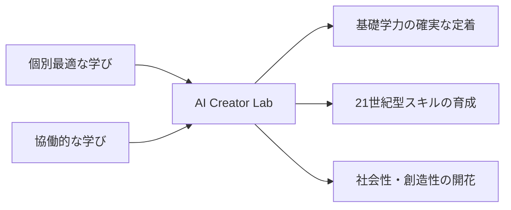

# AI Creator Lab 教育事業企画書
## 〜文科省方針を先行実装するハイブリッド学習塾〜

### エグゼクティブサマリー

本事業は、文部科学省が推進する「個別最適な学び」と「協働的な学び」の二つの教育方針を、民間NPOの柔軟性を活かして先行実装する次世代型学習塾です。

日本の教育現場が直面する「理念と実装のギャップ」を、GPT-4o自社LLMと教育心理学理論の融合により解決し、すべての子どもたちに最適な学習環境を提供します。

---

## 1. 事業コンセプト

### 🎯 コアバリュー
**「AIと人が共創する、一人ひとりに最適化された学びの場」**



### 🏫 三層構造の学習モデル

#### 第1層：行動主義的基礎学習（Foundation Layer）
**目的**: 基礎学力の確実な定着
- **AI適応ドリル**: 個人の理解度に応じた問題生成
- **即時フィードバック**: 間違いをその場で修正
- **ゲーミフィケーション**: 学習意欲の維持・向上
- **スペースド・リピティション**: 最適な復習タイミング

#### 第2層：認知主義的理解深化（Understanding Layer）
**目的**: 概念理解と思考力の育成
- **知識マップ生成**: 学習内容の構造化・可視化
- **メタ認知トレーニング**: 自己の学習を客観視
- **概念間の接続**: 教科横断的な理解促進
- **認知負荷最適化**: 個人の処理能力に応じた調整

#### 第3層：構成主義的探究創造（Creation Layer）
**目的**: 探究力・創造力・協働力の育成
- **PBL（プロジェクト型学習）**: 実社会の課題解決
- **国際交流プログラム**: グローバル視点の獲得
- **アート・STEAM教育**: 創造性の開発
- **サードプレイス活動**: 安心できる居場所での成長

---

## 2. 教育メソドロジー

### 📊 Big Five診断による個別最適化

#### 初回診断プロセス（5分）
```typescript
interface PersonalityDiagnosis {
  // 子ども向け簡易版Big Five
  questions: {
    openness: "新しいことに挑戦するのは好き？",
    conscientiousness: "計画を立てて勉強する方？",
    extraversion: "友だちと一緒が楽しい？",
    agreeableness: "みんなと協力するのが得意？",
    neuroticism: "緊張しやすい方？"
  },
  
  // 診断結果に基づく学習スタイル提案
  learningStyle: {
    individual_vs_group: number,  // 個人学習 ← → グループ学習
    structured_vs_exploratory: number, // 構造的 ← → 探究的
    visual_vs_verbal: number,     // 視覚的 ← → 言語的
    fast_vs_slow: number          // 速習型 ← → じっくり型
  }
}
```

#### 学習プラン自動生成
1. **性格特性分析** → 最適な学習環境設定
2. **認知スタイル判定** → 教材提示方法の決定
3. **動機づけタイプ** → 報酬システムの個別化
4. **社会性評価** → グループ活動の頻度調整

### 🤖 GPT-4o教育特化ファインチューニング

#### トレーニングデータセット
```python
educational_datasets = {
    # 教育心理学ベース
    "scaffolding_patterns": 15000,  # 足場かけパターン
    "zone_proximal_development": 10000,  # ZPD適応例
    "cognitive_load_management": 8000,  # 認知負荷調整
    
    # 年齢別対応
    "elementary_interactions": 20000,  # 小学生向け対話
    "middle_school_guidance": 15000,   # 中学生向け指導
    "high_school_mentoring": 10000,    # 高校生向けメンタリング
    
    # 安全性・倫理
    "child_safety_filters": 5000,      # 児童保護フィルター
    "educational_ethics": 3000,        # 教育倫理ガイドライン
    "positive_reinforcement": 8000     # ポジティブ強化パターン
}
```

### 🏛️ サードプレイス型学習環境

#### ハイブリッド学習空間の設計
**オンライン空間**
- **24/7 AIチャットサポート**: いつでも質問可能
- **バーチャル自習室**: 仲間の存在を感じながら学習
- **デジタルポートフォリオ**: 成長の可視化
- **保護者ダッシュボード**: 透明性の確保

**オフライン空間**（週1-2回）
- **公民館・コミュニティセンター**: 地域密着型
- **少人数グループ活動**: 6-8名の最適サイズ
- **メンター・ファシリテーター**: 人間の温かさ
- **創作・実験スペース**: hands-on学習

---

## 3. カリキュラム設計

### 📚 年齢別プログラム体系

#### 小学生低学年（1-3年生）
**ビギナーコース：「わくわく探検隊」**
```yaml
月曜: AIとおしゃべり（対話型学習）
火曜: プログラミング遊び（Scratch Jr.）
水曜: デジタルアート（創作活動）
木曜: ロボット工作（STEM入門）
金曜: みんなで発表会（協働学習）

学習目標:
- デジタルリテラシーの基礎
- 創造性と好奇心の育成
- 協調性の基礎づくり
```

#### 小学生高学年（4-6年生）
**ジュニアコース：「未来クリエイター」**
```yaml
基礎学習（AIドリル）: 
- 算数・国語の個別最適化
- 英語４技能トレーニング
- プログラミング基礎（Python入門）

探究プロジェクト:
- SDGs課題解決プロジェクト
- 地域課題リサーチ
- 国際交流（オンライン）

創造活動:
- 3DCG制作（Blender）
- ゲーム開発（Unity）
- AIアート生成
```

#### 中高生
**アドバンスコース：「イノベーター養成」**
```yaml
専門スキル開発:
- 機械学習入門
- Webアプリ開発
- データサイエンス基礎

実践プロジェクト:
- スタートアップ体験
- 社会実装プロジェクト
- インターンシップ連携

進路支援:
- ポートフォリオ作成
- AO入試対策
- キャリアメンタリング
```

---

## 4. 料金体系と社会的包摂

### 💰 スライディングスケール料金制度

| 世帯区分 | 週1回 | 週2回 | 週3回以上 | オンラインのみ |
|---------|-------|-------|-----------|---------------|
| 通常世帯 | ¥8,000 | ¥14,000 | ¥18,000 | ¥5,000 |
| 低所得世帯 | ¥4,000 | ¥7,000 | ¥9,000 | ¥2,500 |
| ひとり親世帯 | ¥2,000 | ¥3,500 | ¥4,500 | ¥1,000 |
| 生活保護世帯 | 無料 | ¥1,000 | ¥2,000 | 無料 |

**特別支援**
- 不登校児童：50%割引 + 個別サポート
- 発達特性：専門スタッフ配置（追加料金なし）
- 兄弟割引：2人目以降50%OFF
- 紹介割引：双方1ヶ月無料

### 🤝 包摂的な学習コミュニティ

**多様性の受け入れ**
- 学習スピードの違いを前提とした設計
- 神経多様性（ニューロダイバーシティ）への配慮
- 多言語対応（英語・中国語・ポルトガル語）
- バリアフリー環境の整備

---

## 5. 実装ロードマップ

### 📅 段階的展開計画

#### Phase 0: 準備期（現在〜1ヶ月）
- [x] 事業計画策定
- [ ] 資金調達（助成金申請）
- [ ] 技術基盤選定
- [ ] パートナーシップ構築

#### Phase 1: MVP開発（1-3ヶ月）
- [ ] GPT-4o環境構築
- [ ] 基本的なAIチャット実装
- [ ] Big Five診断システム
- [ ] 学習管理システム基盤

#### Phase 2: パイロット運用（4-6ヶ月）
- [ ] 限定30名でのテスト運用
- [ ] フィードバック収集・改善
- [ ] 教材コンテンツ拡充
- [ ] 効果測定・分析

#### Phase 3: 本格展開（7-12ヶ月）
- [ ] 3拠点での運営開始
- [ ] 受講生200名規模
- [ ] 成果発表・事例公開
- [ ] 次期拡大準備

#### Phase 4: スケール化（2年目〜）
- [ ] 全国10拠点展開
- [ ] 受講生1,000名規模
- [ ] 海外展開準備
- [ ] 政策提言・標準化

---

## 6. 期待される成果

### 📊 定量的成果（1年後）

| 指標 | 目標値 | 測定方法 |
|------|--------|----------|
| 受講生数 | 200名 | 登録データ |
| 学習継続率 | 85% | システムログ |
| 学力向上 | 平均30%向上 | 標準テスト |
| 保護者満足度 | 90%以上 | アンケート |
| 教師負担軽減 | 40%削減 | タイムスタディ |

### 🌟 定性的成果

**学習者への影響**
- 学習への自信と意欲の向上
- メタ認知能力の発達
- 創造性と問題解決力の育成
- 社会性とコミュニケーション力の向上

**社会への影響**
- 教育格差の是正モデル提示
- 不登校・学習困難児支援の新手法
- 教員働き方改革の実例
- 地域教育力の再生

**教育システムへの影響**
- 文科省方針の実装モデル
- 民間教育のイノベーション
- 国際的な教育モデルとしての発信
- 次世代教育標準の確立

---

## 7. リスク管理と持続可能性

### ⚠️ リスク分析と対策

| リスク項目 | 影響度 | 発生確率 | 対策 |
|-----------|-------|---------|------|
| AI品質の不安定性 | 高 | 中 | 段階的導入、人間のバックアップ |
| 個人情報漏洩 | 高 | 低 | セキュリティ監査、暗号化 |
| 講師・メンター不足 | 中 | 中 | 大学連携、ボランティア活用 |
| 資金調達の遅れ | 高 | 中 | 複数財源確保、段階的投資 |
| 保護者の理解不足 | 中 | 高 | 丁寧な説明会、体験会実施 |

### 🔄 持続可能な運営モデル

**収益源の多様化**
1. 月額受講料（スライディングスケール）
2. 企業向け研修プログラム
3. 教材・システムのライセンス提供
4. 助成金・寄付（NPO優位性）
5. 行政委託事業

**コスト最適化**
- GPT-4o自社運用による85%コスト削減
- ボランティア・インターン活用
- 公共施設の活用
- オープンソース技術の採用

---

## 8. パートナーシップ戦略

### 🤝 戦略的連携

**教育機関**
- 大学教育学部：研究連携、学生インターン
- 教育委員会：不登校支援連携
- 国際交流協会：グローバルプログラム

**テクノロジー企業**
- Microsoft：Azure NPO支援プログラム
- Google：Google for Education連携
- 地域IT企業：技術支援、CSR連携

**地域コミュニティ**
- 公民館・コミュニティセンター：場所提供
- 地域NPO：相互送客、共同事業
- 保護者会：運営参画、口コミ拡散

**行政・財団**
- 文部科学省：実証事業採択
- 経済産業省：EdTech補助金
- 民間財団：教育助成金

---

## 9. 成功への道筋

### 🎯 クリティカル・サクセス・ファクター

1. **技術と教育の融合**
   - AI技術の教育的価値への変換
   - 教育理論に基づく実装

2. **現場教師との協働**
   - 対立ではなく補完関係
   - 教師の専門性を活かす設計

3. **保護者の信頼獲得**
   - 透明性の高い運営
   - 定期的な成果報告

4. **継続的な改善**
   - データに基づくPDCA
   - 利用者フィードバックの反映

5. **社会的インパクトの可視化**
   - 成果の定量化と発信
   - メディア露出と認知拡大

---

## 10. ビジョンと使命

### 🌟 ビジョン
**「すべての子どもたちが、自分らしく輝きながら学び、未来を創造する力を身につける社会」**

### 🎯 ミッション
1. AIと人間の教師が協働する新しい教育モデルの確立
2. 教育格差を解消し、すべての子どもに最適な学習機会を提供
3. 21世紀を生きる力（創造性・協働性・批判的思考）の育成
4. 地域コミュニティと連携した持続可能な教育エコシステムの構築

### 💫 コアバリュー
- **Personalization（個別最適化）**: 一人ひとりに寄り添う
- **Collaboration（協働）**: 共に学び、共に成長する
- **Innovation（革新）**: 常に新しい学びを追求する
- **Inclusion（包摂）**: 誰一人取り残さない
- **Sustainability（持続可能性）**: 未来につながる教育

---

## まとめ

AI Creator Labは、日本の教育が直面する「理念と実装のギャップ」を埋める革新的な学習塾です。

文科省が推進する「個別最適な学び」と「協働的な学び」を、GPT-4o自社LLMと教育心理学理論の融合により実現し、すべての子どもたちに最高の学習体験を提供します。

これは単なる学習塾事業ではなく、**日本の教育改革を民間から推進し、世界に発信する社会変革プロジェクト**です。

私たちは、AIと人間が共創する新しい教育の形を通じて、子どもたちの無限の可能性を解き放ちます。