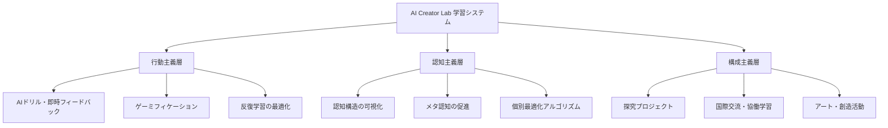
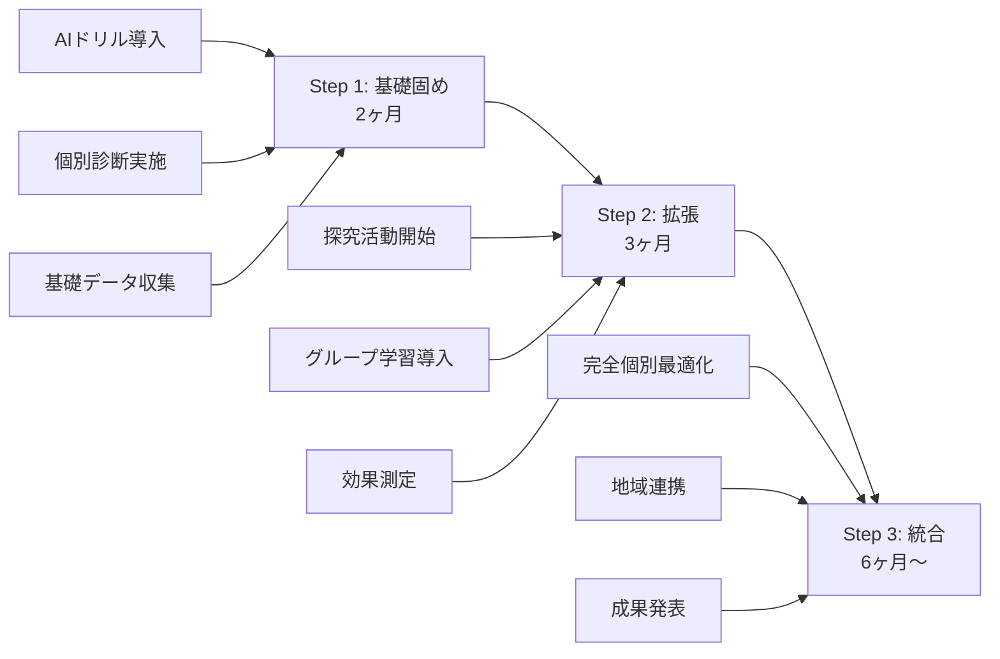
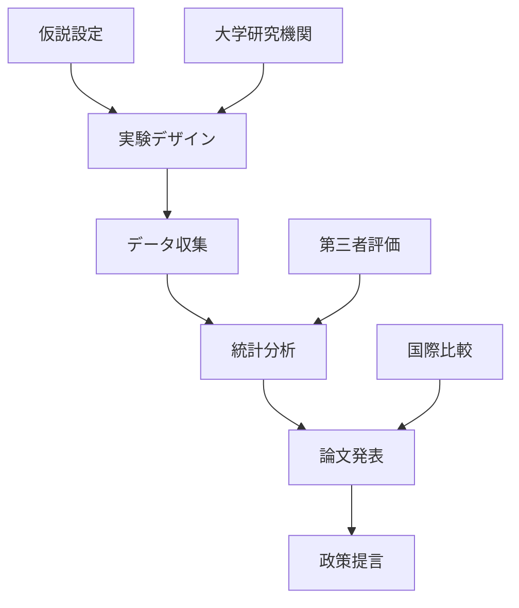

# AI Creator Lab プロジェクト背景書

## 📊 日本教育の歴史的変遷と現状の課題

### 🔄 教育理論の変遷と日本の教育政策

#### 1. 戦後〜高度経済成長期（1950〜1970年代）
**教育理論：行動主義（Behaviorism）**
- **国家戦略**: 均質な労働力の大量育成
- **教育方法**: 
  - 一斉授業・詰め込み式教育
  - 反復練習・暗記重視
  - 偏差値による効率的な人材選別
- **成果**: 高度経済成長を支える人材輩出に成功
- **問題点**: 創造性・個性の軽視、画一的な人材育成

#### 2. ゆとり教育期（1980〜2000年代初頭）
**教育理論：認知主義・構成主義へのシフト（理念）**
- **国家戦略**: 創造性・国際競争力の向上
- **掲げた理念**:
  - 「生きる力」の育成
  - 探究学習・自己表現の重視
  - 総合的な学習の時間の導入
- **現場の実態**:
  - 授業時間削減による混乱
  - 教師の準備・研修不足
  - 評価基準の曖昧さ
  - 結果として従来型授業の継続
- **教訓**: **理念は正しかったが実装が失敗**

#### 3. 学力重視回帰期（2000〜2010年代）
**教育理論：行動主義への回帰＋部分的認知主義**
- **国家戦略**: PISAショック後の国際学力向上
- **教育方法**:
  - 全国学力テスト導入
  - 基礎学力重視への回帰
  - ICT活用の試行開始
- **成果**: 国際学力調査での順位回復
- **問題点**: 探究的学習の形骸化

#### 4. 現在（2020年代〜）
**教育理論：三大理論のハイブリッド化**
- **国家戦略**: Society 5.0時代の人材育成
- **文科省の二つの方針**:
  1. **個別最適な学び**: AI・データ活用による個人適応
  2. **協働的な学び**: 対話・探究による社会性育成
- **現場の課題**:
  - ICT活用スキル不足
  - 教員の多忙化
  - 評価制度の未整備
  - 理念と実践の乖離

---

## 🎯 本プロジェクトの位置づけ

### なぜ今、AI Creator Labが必要なのか

#### 1. 文科省方針の先行実装
国が推進する「個別最適な学び」と「協働的な学び」の二つの方針は、多くの教育現場で実装が遅れています。本プロジェクトは、これらを**民間NPOの柔軟性**を活かして先行実装し、成功モデルを示します。

#### 2. ゆとり教育の教訓を活かした設計
**ゆとり教育が失敗した原因**:
- ✗ 理念だけで実装方法が不明確
- ✗ 教師へのサポート不足
- ✗ 評価基準の欠如
- ✗ 現場への丸投げ

**本プロジェクトの解決策**:
- ✓ AI技術による具体的な実装方法
- ✓ 自動化による教師の負担軽減
- ✓ データに基づく明確な評価基準
- ✓ 段階的な導入プロセス

#### 3. 三大教育理論の統合実装


---

## 教育理論に基づくシステム設計

### 行動主義的アプローチ（基礎学力の定着）
**理論的根拠**: スキナーのオペラント条件づけ理論
- **実装方法**:
  - AIドリルによる反復練習
  - 即時フィードバックシステム
  - ポイント・バッジによる動機づけ
  - マスタリー・ラーニング（完全習得学習）

### 認知主義的アプローチ（理解と思考力）
**理論的根拠**: ブルーナーの発見学習、情報処理理論
- **実装方法**:
  - 学習履歴に基づく知識構造の可視化
  - 既習知識とのリンク形成
  - 認知負荷理論に基づく難易度調整
  - メタ認知スキルの育成支援

### 構成主義的アプローチ（探究と創造）
**理論的根拠**: ピアジェの発達段階論、ヴィゴツキーのZPD理論
- **実装方法**:
  - プロジェクト型学習（PBL）
  - サードプレイスでの協働活動
  - 国際交流プログラム
  - 最近接発達領域（ZPD）を考慮した課題設定

---

## 実装戦略：理念を現実にする10の原則

### 実装原則1：具体的な方法論の提供

#### AIによる自動化と標準化
```typescript
// 探究学習の具体的な実装例
interface ExploratoryLearning {
  // AIが提供する探究テンプレート
  templates: {
    questionGeneration: "なぜ〇〇は△△なのか？",
    hypothesisFormation: "もし〇〇なら△△になるはず",
    experimentDesign: "〇〇を調べるために△△をする",
    dataCollection: "観察・記録・分析の方法",
    conclusion: "結果から分かったこと"
  },
  
  // 段階的なスキャフォルディング
  scaffolding: {
    beginner: "AIが80%サポート",
    intermediate: "AIが50%サポート",
    advanced: "AIが20%サポート"
  }
}
```

### 実装原則2：明確な評価基準

#### ルーブリック評価システム
```yaml
探究力評価:
  レベル1（初級）:
    - 与えられた問いに答えられる
    - 基本的な情報収集ができる
    - 簡単な観察記録ができる
    
  レベル2（中級）:
    - 自分で問いを立てられる
    - 複数の情報源を比較できる
    - データを整理・分析できる
    
  レベル3（上級）:
    - 独創的な問いを立てられる
    - 批判的に情報を評価できる
    - 新しい知見を生み出せる

協働力評価:
  観察項目:
    - 他者の意見を聞く姿勢
    - 自分の考えを伝える力
    - 合意形成への貢献
    - リーダーシップ/フォロワーシップ
```

### 実装原則3：教師の負担軽減

#### AI支援による自動化
| 従来の教師の仕事 | AI Creator Labでの自動化 | 教師の新しい役割 |
|-----------------|-------------------------|----------------|
| 個別の学習計画作成 | AIが自動生成 | 計画の確認・調整 |
| ドリルの採点 | 自動採点・分析 | つまずきへの個別対応 |
| 学習進捗の記録 | 自動ログ・可視化 | 保護者との対話 |
| 教材の準備 | AI推薦・自動生成 | 創造的な活動の設計 |

### 実装原則4：段階的導入プロセス

#### 3段階の導入ステップ


### 実装原則5：保護者の理解と参画

#### 透明性の高いコミュニケーション
```typescript
interface ParentEngagement {
  // リアルタイムダッシュボード
  dashboard: {
    dailyProgress: "今日の学習内容と成果",
    weeklyReport: "週次レポート（AI自動生成）",
    monthlyMeeting: "月1回のオンライン面談",
    portfolioAccess: "作品・成果物の閲覧"
  },
  
  // 保護者教育プログラム
  education: {
    workshops: "AI時代の子育てワークショップ",
    tutorials: "家庭学習サポート方法",
    community: "保護者コミュニティ"
  },
  
  // 参画機会
  participation: {
    guestTeacher: "専門知識を活かした授業",
    eventSupport: "イベント運営協力",
    mentoring: "キャリアメンタリング"
  }
}
```

### 実装原則6：データ駆動型改善

#### PDCAサイクルの自動化
```python
class ContinuousImprovement:
    def __init__(self):
        self.metrics = {
            "engagement_rate": "日次測定",
            "completion_rate": "週次測定",
            "satisfaction_score": "月次測定",
            "learning_outcomes": "四半期測定"
        }
    
    def analyze(self):
        # AIが自動分析
        return {
            "bottlenecks": "つまずきポイントの特定",
            "success_patterns": "成功パターンの抽出",
            "recommendations": "改善提案の生成"
        }
    
    def implement(self):
        # 自動的に学習プログラムを調整
        return "次週から反映"
```

### 実装原則7：現場教師との協働

#### 補完関係の構築
```yaml
AIの役割:
  - 個別学習計画の生成
  - 基礎練習の自動化
  - 学習データの分析
  - 24時間サポート

人間教師の役割:
  - 感情的サポート
  - 創造的活動のファシリテーション
  - 倫理的判断
  - ロールモデル

協働領域:
  - 学習目標の設定
  - 評価基準の調整
  - 保護者対応
  - キャリア指導
```

### 実装原則8：柔軟な学習環境

#### ハイブリッド型の選択肢
| 学習スタイル | 対象 | 形態 | 特徴 |
|------------|------|------|------|
| フルオンライン | 不登校・遠隔地 | 完全オンライン | AI中心、自己ペース |
| ハイブリッド | 標準的な学習者 | 週1-2回対面 | バランス型 |
| 対面重視 | 社会性重視 | 週3-4回対面 | 協働学習中心 |
| カスタム | 特別支援 | 個別設計 | 完全個別対応 |

### 実装原則9：エビデンスベースの効果検証

#### 学術的検証プロセス


### 実装原則10：持続可能な財務モデル

#### 多層的な収益構造
```typescript
const revenueModel = {
  // 基本収益（B2C）
  tuitionFees: {
    regular: "通常料金",
    sliding: "スライディングスケール",
    subscription: "月額サブスク"
  },
  
  // 付加価値サービス（B2C）
  premiumServices: {
    intensive: "集中講座",
    mentoring: "個別メンタリング",
    certification: "資格認定"
  },
  
  // 法人向け（B2B）
  corporate: {
    training: "企業研修",
    consulting: "教育コンサル",
    licensing: "システムライセンス"
  },
  
  // 公的資金
  publicFunding: {
    grants: "助成金",
    subsidies: "補助金",
    contracts: "委託事業"
  }
}
```

### 成功への10の約束

1. **理念を技術で実装する** - AIで理想を現実に
2. **現場の声を聞き続ける** - 継続的なフィードバック
3. **小さく始めて大きく育てる** - 段階的拡大
4. **失敗を恐れず学び続ける** - アジャイル思考
5. **透明性を保つ** - オープンな運営
6. **協働を大切にする** - ステークホルダー連携
7. **データに基づいて判断する** - エビデンス重視
8. **子どもを中心に考える** - 学習者ファースト
9. **持続可能性を追求する** - 長期的視点
10. **社会変革を目指す** - より良い教育の実現

---

## 💡 期待される社会的インパクト

### 1. 教育格差の解消
- **現状**: 経済格差による教育機会の不平等
- **解決**: スライディングスケール料金制度とAI個別最適化により、すべての子どもに質の高い教育を提供

### 2. 不登校・学習困難児への支援
- **現状**: 画一的な学校教育に適応できない子どもの増加
- **解決**: 個別最適化とサードプレイス型の居場所提供

### 3. 教員の働き方改革
- **現状**: 教員の多忙化と疲弊
- **解決**: AI自動化による負担軽減と本質的な教育活動への集中

### 4. 日本教育のモデルケース
- **現状**: 文科省方針の実装遅れ
- **解決**: 成功事例の創出と全国展開の基盤構築

---

## 📊 成功指標（KPI）

### 教育効果指標
| 指標 | 現状 | 目標（1年後） | 測定方法 |
|------|------|---------------|----------|
| 学習継続率 | 一般塾60% | 85% | システムログ |
| 学力向上率 | - | 平均30%向上 | 標準テスト |
| メタ認知スキル | - | 有意な向上 | ルーブリック評価 |
| 協働スキル | - | 80%が向上実感 | アンケート調査 |

### 社会的インパクト指標
| 指標 | 目標（3年後） | 測定方法 |
|------|--------------|----------|
| 受講者数 | 3,000名 | 登録データ |
| 不登校児童支援率 | 30% | 実績データ |
| 教員負担軽減 | 40%削減 | タイムスタディ |
| 他地域展開 | 10拠点 | 契約数 |

---

## 🌟 ビジョン

### ミッション
「AIと人間の教師が協働し、一人ひとりの可能性を最大限に引き出す教育エコシステムを創造する」

### 3年後の姿
- 文科省の教育方針を完全実装した先進モデル
- 全国10拠点で3,000名の子どもたちが学ぶ
- 教育格差解消の成功事例として国際的認知
- 次世代教育のスタンダードとして政策提言

### 10年後の展望
- アジア圏への国際展開
- 100万人の学習者をサポート
- 日本発の教育イノベーションとして世界標準化
- Society 5.0時代の人材育成プラットフォーム

---

## 📝 結論

AI Creator Labは、日本の教育が70年かけて試行錯誤してきた「行動主義」「認知主義」「構成主義」の統合を、最新のAI技術によって実現します。

文科省が掲げる「個別最適な学び」と「協働的な学び」の二つの方針を、現場の遅れを待たずに先行実装し、ゆとり教育の失敗から学んだ「理念だけでなく実装」を重視した設計により、日本教育の新たなモデルを創出します。

これは単なる学習塾ではなく、**日本の教育改革を民間から推進する社会変革プロジェクト**です。