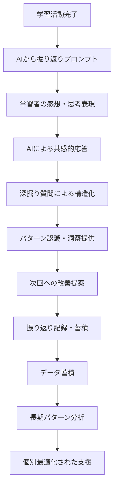

# AI型メタ認知リフレクションとは？

## 概要

**AI型メタ認知リフレクション**は、AIチャットボットとの対話を通じて、学習者が自分の思考プロセスや学習状況を客観的に振り返る革新的な手法です。従来の一人での内省や他者からのフィードバックの限界を、AIの特性を活かして克服します。

---

## 2つのリフレクションの統合実現

AI Creator LabのAIチャットボットは、**2種類のリフレクションを同時に実現**することで、従来では不可能だった包括的な学習支援を提供します。

### 1. セルフ・メタ認知リフレクション（Self-metacognitive reflection）

#### 定義
自分で日記やメモを書くように、自分の考え・感覚をAIに言語化して整理するプロセス

#### 従来の問題点
- **継続の困難**: 一人での内省は継続が困難
- **客観性の欠如**: 自分だけでは主観的になりがち
- **構造化の困難**: どう振り返ればよいかわからない

#### AI活用による解決
```typescript
interface SelfReflection {
  // AIとの対話による思考の言語化
  verbalization: {
    prompt: "今日の学習で感じたことを聞かせてください",
    response: "学習者の感情・思考の整理",
    clarification: "曖昧な部分への質問で深掘り"
  },
  
  // 構造化された振り返り
  structured_reflection: {
    what_happened: "何が起こったか（事実）",
    how_felt: "どう感じたか（感情）",
    why_think: "なぜそう思うか（分析）",
    what_learned: "何を学んだか（洞察）"
  },
  
  // 継続的サポート
  continuous_support: {
    daily_check: "毎日の振り返りプロンプト",
    pattern_recognition: "学習パターンの発見",
    progress_visualization: "成長の可視化"
  }
}
```

### 2. ソーシャル・リフレクション（Social reflection）

#### 定義
本来は他人からのフィードバックで得られる他者視点からの気づき

#### 従来の問題点と限界
- **偏見・バイアス**: 人間同士だと先入観が介入
- **社会的制約**: 煩わしさ、遠慮、人間関係への配慮
- **時間的制限**: 相手の都合、限られた時間
- **心理的障壁**: 言いにくい悩みや恥ずかしさ

#### AI活用による革新的解決
```python
class AIReflectionAdvantages:
    """AIによるソーシャル・リフレクションの利点"""
    
    def __init__(self):
        self.neutrality = {
            "no_bias": "偏見・先入観なし",
            "no_judgment": "判断や評価をしない姿勢",
            "objective_mirror": "学びの鏡として中立的に反映"
        }
        
        self.accessibility = {
            "24_7_available": "24時間365日利用可能",
            "infinite_patience": "無限の忍耐力",
            "no_social_pressure": "社会的プレッシャーなし",
            "safe_space": "安全な相談空間"
        }
        
        self.psychological_safety = {
            "confidentiality": "完全な秘匿性",
            "no_embarrassment": "恥ずかしさなし",
            "express_freely": "自由な表現が可能",
            "no_relationship_risk": "人間関係リスクなし"
        }
```

---

## 科学的根拠と理論的基盤

### メタ認知理論
- **出典**: Flavell, J. H. (1976). Metacognitive aspects of problem solving. *The Nature of Intelligence*, 231-235.
- **要点**: メタ認知的知識・経験・方略の重要性

### リフレクション理論
- **出典**: Schön, D. A. (1983). *The Reflective Practitioner: How Professionals Think in Action*. Basic Books.
- **実装**: 行為の中の省察（reflection-in-action）と行為についての省察（reflection-on-action）

### 社会認知理論
- **出典**: Bandura, A. (2001). Social cognitive theory: An agentic perspective. *Annual Review of Psychology*, 52(1), 1-26.
- **応用**: 他者観察による学習を AIとの対話で代替

---

## 実装アーキテクチャ

### AIチャットボットの設計

```typescript
interface MetacognitiveReflectionBot {
  // 対話エンジン
  conversation_engine: {
    natural_language_processing: "自然な対話理解",
    empathetic_responses: "共感的応答生成",
    context_awareness: "文脈理解・記憶保持"
  },
  
  // リフレクション促進機能
  reflection_facilitation: {
    guided_questions: {
      surface_level: "今日はどんなことを学びましたか？",
      deep_level: "なぜそう感じたのでしょうか？",
      meta_level: "自分の学習方法について気づいたことはありますか？"
    },
    
    pattern_recognition: {
      learning_habits: "学習習慣のパターン発見",
      emotional_patterns: "感情的パターンの特定",
      cognitive_patterns: "認知的傾向の分析"
    },
    
    feedback_generation: {
      strengths_identification: "強みの発見・言語化",
      improvement_suggestions: "改善点の提案",
      goal_alignment: "目標との整合性確認"
    }
  },
  
  // データ分析・可視化
  analytics: {
    reflection_frequency: "振り返り頻度の追跡",
    insight_quality: "洞察の質的分析",
    behavioral_changes: "行動変化の測定"
  }
}
```

### 振り返りセッションの流れ



---

## 具体的な対話例

### セルフ・リフレクション例
```
学習者: 「今日のプログラミングの課題、すごく難しくて全然進まなかった...」

AI: 「難しい課題に取り組んでいたんですね。『全然進まなかった』とおっしゃいましたが、具体的にはどの部分で躓いてしまったのでしょうか？」

学習者: 「ループの部分がどうしても理解できなくて...」

AI: 「ループの概念で困っていたんですね。これまでのプログラミング学習で、同じように最初は難しく感じたけれど、最終的に理解できたものはありませんか？」

学習者: 「そういえば、if文も最初はわからなかったけど、今は普通に使えるようになった」

AI: 「素晴らしい気づきですね！if文をマスターできた時のことを思い出してみてください。どんな学習方法が効果的でしたか？」
```

### ソーシャル・リフレクション例
```
学習者: 「みんなの前で発表するのが本当に苦手で、いつも緊張してしまう...人に相談するのも恥ずかしくて」

AI: 「発表への不安を抱えているんですね。他の人には相談しづらいお気持ち、よくわかります。まず、発表の時に一番気になるのはどんなことでしょうか？」

学習者: 「間違えたら恥ずかしいし、みんなから変に思われそうで...」

AI: 「『間違えたら恥ずかしい』『変に思われそう』という気持ちなんですね。でも少し別の角度から考えてみましょう。あなたが他の人の発表を聞いている時、その人が少し間違えたら『変な人だ』と思いますか？」

学習者: 「いや、そんなことは思わないけど...むしろ頑張ってるなって思う」

AI: 「まさにその通りです！あなたが他の人に対して感じる温かい気持ちを、周りの人もあなたに対して感じている可能性が高いんです。この気づきはとても大切ですね。」
```

---

## 教育学的意義

### 1. 継続的な学習改善
- **即座のフィードバック**: 学習直後の振り返りで記憶が鮮明
- **習慣化の促進**: 毎日の短い振り返りで継続性を確保
- **成長の実感**: 過去の振り返りとの比較で進歩を確認

### 2. 深い自己理解の促進
- **認知的特性の発見**: 自分の学習パターン・思考の癖を把握
- **感情的パターンの認識**: ストレス反応や動機の源泉を理解
- **価値観の明確化**: 何を大切にしているかの自覚

### 3. 学習者の主体性向上
- **自己調整学習**: 自分で学習をコントロールする力
- **問題解決力**: 困難に直面した時の対処法発見
- **レジリエンス**: 失敗から立ち直る力の育成

---

## 従来手法との比較

| 項目 | 従来の一人での内省 | 他者からのフィードバック | AI型メタ認知リフレクション |
|------|-------------------|----------------------|--------------------------|
| **客観性** | 主観的になりがち | 偏見・バイアス混入 | ✓ 中立的・客観的 |
| **継続性** | 続けるのが困難 | 相手の都合に依存 | ✓ 24時間365日利用可 |
| **心理的安全** | 内向的になりがち | 人間関係リスクあり | ✓ 完全に安全な環境 |
| **深度** | 表面的になりがち | 時間制限あり | ✓ 無限に深掘り可能 |
| **記録・分析** | 記録が困難 | データ化困難 | ✓ 全て記録・分析可能 |
| **個別最適化** | 同じパターンの繰り返し | 個人差理解に限界 | ✓ データ基盤の個別化 |

---

## 実装における注意点

### 1. 人間的温かさの保持
```yaml
design_principles:
  empathy: "共感的応答の重視"
  warmth: "温かみのある対話調"
  encouragement: "励ましと肯定の提供"
  respect: "学習者の価値観・感情の尊重"
```

### 2. プライバシー保護
- **データ暗号化**: 対話内容の完全暗号化
- **アクセス制御**: 学習者本人のみがアクセス可能
- **透明性**: データ使用方法の明示

### 3. 適切な境界設定
- **専門外事項**: 医療・法律等は専門機関を案内
- **危機的状況**: 緊急時は人間のカウンセラーに接続
- **学習支援の範囲**: 教育的文脈での支援に限定

---

## 期待される効果

### 短期効果（1-3ヶ月）
- 学習への自己理解深化
- 振り返り習慣の定着
- 学習モチベーションの向上

### 中期効果（6-12ヶ月）
- メタ認知能力の向上
- 自己調整学習スキルの習得
- 学習効率の改善

### 長期効果（1-3年）
- 生涯学習マインドセットの確立
- 問題解決能力の向上
- レジリエンス（回復力）の強化

---

## 参考文献

### メタ認知・リフレクション研究
1. Schraw, G., & Dennison, R. S. (1994). Assessing metacognitive awareness. *Contemporary Educational Psychology*, 19(4), 460-475.
2. Dewey, J. (1933). *How We Think: A Restatement of the Relation of Reflective Thinking to the Educative Process*. D.C. Heath.
3. Zimmerman, B. J. (2002). Becoming a self-regulated learner: An overview. *Theory Into Practice*, 41(2), 64-70.

### AIと教育
1. Luckin, R. (2017). *AI for Learning*. UCL Knowledge Lab.
2. Holmes, W., Bialik, M., & Fadel, C. (2019). *Artificial Intelligence in Education*. Center for Curriculum Redesign.

### 社会認知理論
1. Bandura, A. (2006). *Guide for constructing self-efficacy scales*. Information Age Publishing.
2. Zimmerman, B. J., & Schunk, D. H. (Eds.). (2011). *Handbook of Self-Regulation of Learning and Performance*. Routledge.

---

*最終更新: 2025年8月*
*文責: AI Creator Lab 教育研究チーム*