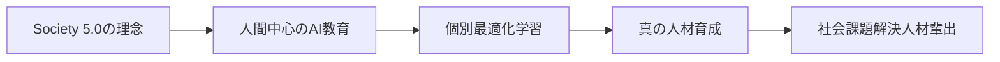
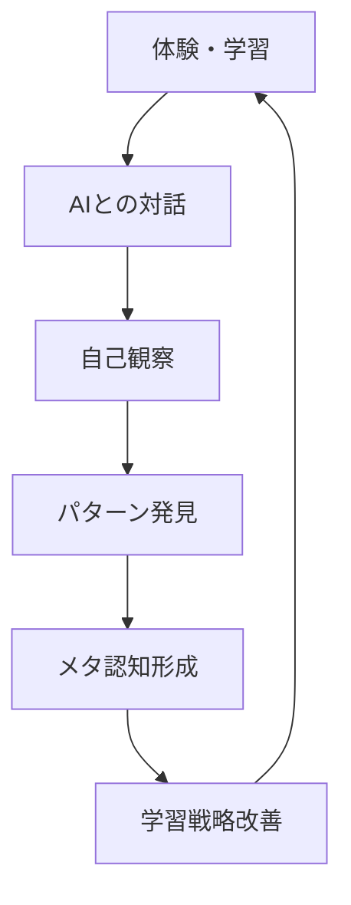
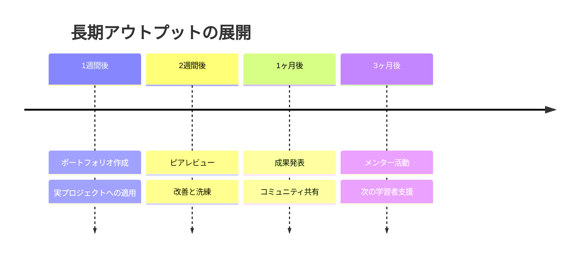

# AI Creator Lab 教育理念とメソドロジー

## 🏛️ 政府方針との整合性

### 国が掲げる二つの重要政策との連携

AI Creator Labの教育理念は、日本政府が推進する以下の基幹政策と完全に整合し、その実現を加速させます。

#### 1. **Society 5.0：人間中心の超スマート社会**
> 内閣府「第5期科学技術基本計画」（2016年）で提唱

**政府ビジョン**
- サイバー空間とフィジカル空間の高度融合
- 経済発展と社会的課題解決の両立
- **人間中心の豊かな社会の実現**

**当プラットフォームの貢献**


- ✅ **人間中心設計**: AIを道具として、人の可能性を最大限に引き出す
- ✅ **個別最適化**: 一人ひとりの特性に応じた学習パスの提供
- ✅ **社会課題解決**: 地域格差・教育格差の解消に貢献

#### 2. **AI戦略2019：デジタル人材25万人育成計画**
> 内閣府・文部科学省が推進（2019年3月29日発表）

**政府目標（2025年まで）**
- **年間25万人**: AIやデータサイエンスを活用できる人材
- **年間2,000人**: AIエキスパート人材の輩出
- 全高校生・大学生がAI基礎を習得

**当プラットフォームの直接的寄与**
| 対象層 | 政府目標 | AI Creator Labの実践 |
|--------|----------|---------------------|
| **大人向け** | 社会人のリスキリング | 3日間集中講座で即戦力AI人材を育成 |
| **子ども向け** | 全児童生徒のAI基礎習得 | 小1〜高校生の段階的AI教育プログラム |
| **法人向け** | 企業内デジタル人材育成 | カスタム企業研修による組織的スキルアップ |

### 文部科学省「教育DX」政策との連動

#### **DXハイスクール事業**（2024-2025年度）
文科省が推進する情報・数学教育重点校での取り組みを、地域レベルで補完・加速

#### **教育DX3本柱**との整合
1. **標準化**: 学習データの意味・定義の統一 → 当プラットフォームの学習分析機能
2. **ツール**: 基盤ツール開発 → AIリフレクション機能の提供
3. **活用**: 教育データの分析・活用促進 → Big Five分析による個別最適化

### 学術的根拠による政策効果の最大化

**従来の課題**
- 一斉一律の授業スタイルの限界
- 個別ニーズへの対応不足
- デジタル人材育成の地域格差

**当プラットフォームのソリューション**
- **科学的個別最適化**: Big Five性格分析 + AI学習パス生成
- **3段階アウトプットシステム**: 記憶定着の科学的メカニズム活用
- **地域格差解消**: オンライン + 公民館ハイブリッドモデル

---

## 📚 核となる教育哲学

### ビジョン
「AIを学びの鏡として、すべての人が自己の可能性を最大限に開花させる」

私たちは、AIを単なるツールではなく、学習者の成長を映し出し、支える「学びの鏡」として位置づけます。この鏡を通じて、学習者は自己を客観的に見つめ、内省し、持続的に成長していくことができます。

### ミッション
1. **民主化された学習機会**: 経済的・地理的制約を超えた学習アクセスの提供
2. **個別最適化された成長**: 一人ひとりの特性に応じた学習パスの設計
3. **実践的スキルの習得**: 即座に活用できる知識とスキルの提供
4. **生涯学習の習慣化**: 継続的な学びのエコシステムの構築

## 🧠 統合的学習理論アプローチ

### 1. 行動主義的基盤
#### 習慣形成の科学
```
トリガー → ルーティン → 報酬 → 習慣化
```

**実装方法**
- **毎日のAI対話習慣**: 朝の5分振り返り、夜の10分リフレクション
- **ストリーク機能**: 連続学習日数の可視化とゲーミフィケーション
- **マイクロラーニング**: 1日15分の小さな学習単位
- **即時フィードバック**: AIによる瞬時の応答と評価

#### スペースド・リピティション（分散学習）
| タイミング | 目的 | 実装例 |
|------------|------|--------|
| 1日後 | 短期記憶の強化 | AIクイズで前日の復習 |
| 3日後 | 中期記憶への移行 | 実践課題の提供 |
| 1週間後 | 長期記憶への定着 | プロジェクトへの応用 |
| 1ヶ月後 | 深い理解の確認 | ポートフォリオ作成 |

### 2. 認知主義的アプローチ
#### メタ認知の育成プロセス



**メタ認知を促す質問例**
- 「今日学んだことで最も重要だと思うことは何ですか？」
- 「なぜそれが重要だと感じたのですか？」
- 「どのような場面でこの知識を活用できそうですか？」
- 「学習中に感じた困難は何でしたか？」
- 「次回はどのようなアプローチを試してみたいですか？」

#### Big Five性格分析による個別最適化

| 性格特性 | 高スコア学習者への対応 | 低スコア学習者への対応 |
|----------|------------------------|------------------------|
| **開放性** | 新しい概念・先端技術の紹介<br>創造的プロジェクト | 構造化された学習パス<br>段階的な新要素導入 |
| **誠実性** | 詳細な学習計画<br>進捗トラッキング | 柔軟なデッドライン<br>小さな達成目標 |
| **外向性** | グループワーク重視<br>発表機会の提供 | 個人学習重視<br>書面でのアウトプット |
| **協調性** | チームプロジェクト<br>ピアサポート | 個人の成果重視<br>競争要素の導入 |
| **神経症傾向** | 頻繁な励まし<br>ストレス管理支援 | チャレンジ課題<br>成長機会の強調 |

### 3. 構成主義的学習環境
#### 探究型学習のフレームワーク

**5Eモデルの実装**
1. **Engage（関心）**: 好奇心を刺激する問いかけ
2. **Explore（探索）**: AIと共に情報を探索
3. **Explain（説明）**: 理解したことを言語化
4. **Elaborate（精緻化）**: 実践への応用
5. **Evaluate（評価）**: 振り返りと次への展開

#### プロジェクトベース学習（PBL）
```
実世界の問題 → 調査・研究 → 解決策の設計 → 実装 → 発表・共有
```

**PBLテーマ例**
- 地域課題をAIで解決する
- 自分の仕事を効率化するツール作成
- 社会問題への創造的アプローチ

## 🔄 3段階アウトプットシステムの詳細

### Phase 1: 即時アウトプット（0-1時間）
#### リフレクティブ・ライティング
**目的**: 学習直後の新鮮な気づきを言語化し、理解を深める

**実装フォーマット**
```markdown
## 今日の学び（YYYY-MM-DD）

### 🎯 学習内容
- 何を学んだか：
- 使用した教材：
- 学習時間：

### 💡 気づき・発見
- 新しく理解したこと：
- 驚いたこと：
- 疑問に思ったこと：

### 🔗 つながり
- 既存知識との関連：
- 実生活への応用：

### 📝 次のステップ
- 深めたいトピック：
- 試してみたいこと：
```

**AIの役割**
- 質問による深掘り
- 関連概念の提示
- 理解度の確認

### Phase 2: 短期アウトプット（24-72時間）
#### エラボレーション（精緻化）
**目的**: 記憶の定着と実践への橋渡し

**活動例**
| 日数 | 活動 | AIサポート |
|------|------|------------|
| 1日後 | ミニテスト実施 | 理解度に応じた問題生成 |
| 2日後 | 応用課題 | 実践的なシナリオ提供 |
| 3日後 | ティーチバック | 説明の論理性チェック |

**分散学習の科学的根拠**
- エビングハウスの忘却曲線対策
- 検索練習効果（Testing Effect）
- 生成効果（Generation Effect）

### Phase 3: 長期アウトプット（1週間以降）
#### ディープ・シンセシス（深い統合）
**目的**: 知識の内在化と創造的応用

**マイルストーン**


## 🤖 AIの教育的役割

### 1. 中立的な学びの鏡として

#### セルフ・リフレクション支援
**AIの特性**
- **無限の忍耐**: 何度でも同じ質問に答える
- **非判断的態度**: 批判せず受け入れる
- **一貫性**: 常に同じ基準でフィードバック
- **24/7利用可能**: いつでも振り返り可能

**対話例**
```
学習者: 今日はPythonの関数がよく理解できなかった
AI: どの部分が特に難しく感じましたか？
学習者: 引数と戻り値の関係がよくわからない
AI: 具体的な例で考えてみましょう。料理のレシピを関数として...
```

#### ソーシャル・リフレクション代替
**仮想的な他者視点の提供**
- 異なる立場からの質問生成
- 多様な解釈の提示
- 建設的な批判的思考の促進

### 2. 適応的学習パートナーとして

#### パーソナライゼーション・エンジン
```python
class LearningPersonalization:
    def __init__(self, learner_profile):
        self.big_five_scores = learner_profile.personality
        self.learning_style = learner_profile.style
        self.progress_data = learner_profile.history
        
    def generate_next_content(self):
        # 性格特性に基づくコンテンツ選択
        if self.big_five_scores['openness'] > 0.7:
            return self.get_innovative_content()
        elif self.big_five_scores['conscientiousness'] > 0.7:
            return self.get_structured_content()
        # ... その他の条件分岐
        
    def adjust_difficulty(self):
        # Zone of Proximal Development (ZPD)に基づく難易度調整
        current_level = self.assess_current_level()
        return current_level * 1.1  # 10%の挑戦を追加
```

### 3. メタ認知コーチとして

#### 認知の歪み検出と修正
| 認知の歪み | AIによる介入例 |
|------------|---------------|
| 全か無か思考 | 「部分的な成功も認識してみましょう」 |
| 過度の一般化 | 「この経験は特定の状況でのものですね」 |
| マインドリーディング | 「実際のデータに基づいて考えてみましょう」 |
| 破局的思考 | 「現実的な結果を一緒に考えてみましょう」 |

## 📊 学習効果の測定と評価

### 多次元評価フレームワーク

#### 1. 知識・スキル次元
- **宣言的知識**: 事実・概念の理解度
- **手続き的知識**: 実践スキルの習熟度
- **条件的知識**: 適切な場面での応用力

#### 2. メタ認知次元
- **自己認識**: 強み・弱みの正確な把握
- **学習戦略**: 効果的な学習方法の選択
- **自己調整**: 学習プロセスの最適化

#### 3. 情意次元
- **動機づけ**: 内発的動機の強さ
- **自己効力感**: 課題達成への自信
- **学習への態度**: ポジティブな学習観

### 成長の可視化ダッシュボード
```typescript
interface LearningDashboard {
  // 定量的指標
  metrics: {
    completionRate: number;
    averageScore: number;
    streakDays: number;
    totalLearningHours: number;
  };
  
  // 定性的指標
  qualitative: {
    reflectionQuality: 'basic' | 'developing' | 'proficient' | 'advanced';
    criticalThinking: number; // 0-100
    creativityIndex: number; // 0-100
    collaborationScore: number; // 0-100
  };
  
  // 成長トレンド
  trends: {
    weeklyProgress: Array<number>;
    skillDevelopment: Map<string, number>;
    engagementPattern: Array<TimeSlot>;
  };
}
```

## 🌟 実装における重要な原則

### 1. スクリーンタイムの質的転換
**従来のスクリーンタイム**: 受動的消費、エンターテインメント中心
**AI学習でのスクリーンタイム**: 能動的創造、探究と成長

### 2. 失敗を学習機会とする文化
- エラーメッセージを学習ヒントに変換
- 間違いから学ぶプロセスの重視
- 心理的安全性の確保

### 3. コミュニティによる相互成長
- ピアラーニングの促進
- メンターシップ制度
- 知識の共有と循環

## 🚀 今後の展開

### 短期目標（3-6ヶ月）
1. MVPの構築と検証
2. 初期ユーザー100名の獲得
3. フィードバックに基づく改善

### 中期目標（6-12ヶ月）
1. AI機能の高度化
2. 学習コンテンツの拡充
3. コミュニティ機能の強化

### 長期ビジョン（1-3年）
1. 国際展開
2. 教育機関との連携
3. 学習科学研究への貢献

## 📚 参考文献・理論的背景

### 学習理論
- Skinner, B.F. (1953). Science and Human Behavior
- Piaget, J. (1970). Genetic Epistemology
- Vygotsky, L.S. (1978). Mind in Society
- Bruner, J. (1996). The Culture of Education

### メタ認知研究
- Flavell, J.H. (1979). Metacognition and Cognitive Monitoring
- Schön, D.A. (1983). The Reflective Practitioner
- Zimmerman, B.J. (2000). Self-Regulated Learning

### AI in Education
- Holmes, W. et al. (2019). Artificial Intelligence in Education
- Luckin, R. (2018). Machine Learning and Human Intelligence

---

*このドキュメントは、AI Creator Labの教育理念の中核を成すものであり、すべての教育活動の指針となります。*