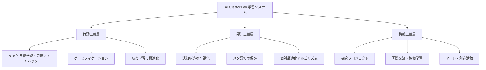
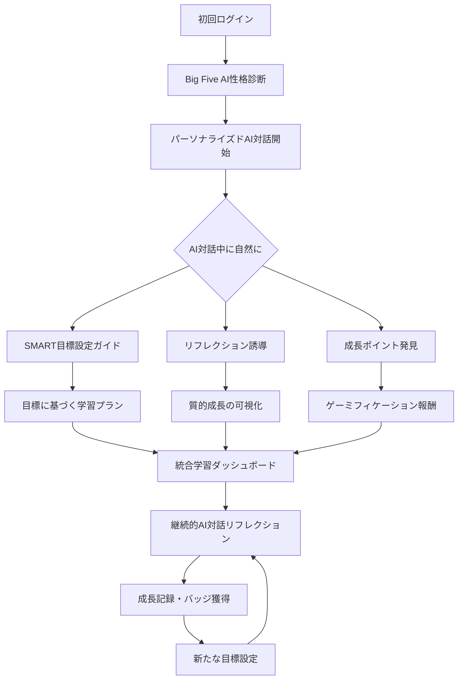
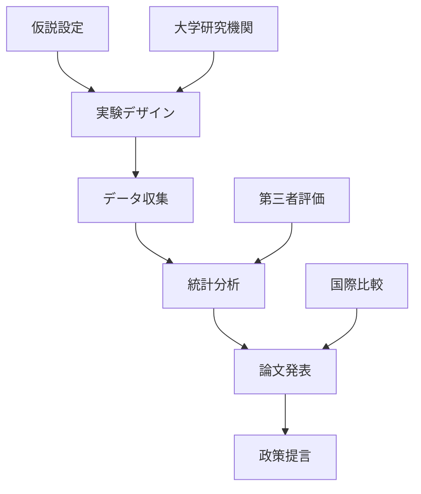

# AI Creator Lab プロジェクト背景書

---

## 🎯 本プロジェクトの位置づけ

### なぜ今、AI Creator Labが必要なのか

#### 1. 文科省方針の先行実装
国が推進する「個別最適な学び」と「協働的な学び」の二つの方針は、多くの教育現場で実装が遅れています。本プロジェクトは、**NPOとしてサードプレイスの強みを活かし、小さく始めることができる環境**で、これらの理念を実現します。**プラットフォームとしてシステム化**し、**オンラインとハイブリッド型**で柔軟に提供することで、従来の教育機関では困難な新しい学習体験を創出します。

#### 2. 誰でも使える教育プラットフォームの実現
**包括的なアクセシビリティ設計**:
- **教育者向け**: 技術知識不要で直感的に使えるインターフェース
- **学習者向け**: 年齢・学習レベル・特性に関係なくアクセス可能
- **保護者向け**: 進捗確認と学習サポートが簡単に行える
- **地域社会向け**: 公民館等の既存施設と連携可能

**プラットフォームの特徴**:
```typescript
interface InclusivePlatform {
  // ユーザビリティ最優先
  design: {
    intuitive: "直感的操作",
    accessible: "アクセシビリティ準拠",
    multilingual: "多言語対応",
    responsive: "あらゆるデバイス対応"
  },
  
  // 教育者支援
  educator_tools: {
    no_coding: "プログラミング不要",
    template_library: "豊富なテンプレート",
    auto_assessment: "自動評価システム",
    progress_analytics: "学習分析ダッシュボード"
  },
  
  // 柔軟な運用
  deployment: {
    cloud: "クラウド完結",
    hybrid: "オンライン・対面ハイブリッド",
    scalable: "小規模～大規模対応",
    customizable: "組織に応じたカスタマイズ"
  }
}
```

#### 3. ゆとり教育の教訓を活かした設計
**ゆとり教育が失敗した原因**:
- ✗ 理念だけで実装方法が不明確
- ✗ 教師へのサポート不足
- ✗ 評価基準の欠如
- ✗ 現場への丸投げ

**本プロジェクトの解決策**:
- ✓ AI技術による具体的な実装方法
- ✓ 自動化による教師の負担軽減
- ✓ データに基づく明確な評価基準
- ✓ 統合実装プロセス

#### 3. 三大教育理論の統合実装


---

## 教育理論に基づくシステム設計

### 教育理論統合の背景と革新性

これまで日本では**行動主義的な立場で安直な暗記法を中心として教育に取り入れられてきました**。行動主義的な立場は世界的にも有力な学派として力がありました。なぜなら、**客観と実験によって観測可能である**のはこの行動主義だけだったからです。内部的な意思決定プロセスなどは観測不能であったため、根拠として乏しいとされてきました（認知主義・構成主義）。

しかし**fMRIなどの外部観測装置が出てきたことによって、脳のパターンからある程度内部的な要因が学習に影響していることが観測可能になり**、今では認知主義と構成主義も重要視されており、**3つの理論それぞれの有効性が認められる手法があり、それらをうまく統合する動き**が強まっています（これは**エクレクティック・アプローチ**または**ハイブリッド・アプローチ**と呼ばれます）。

しかし、**まだ現場レベルでそれが実装されていません**。教育現場では教育者の育成などにも時間がかかります。そこで**AIにこれらの要件を学習させ、仕組み化したプラットフォームを提供する**ことで、理論統合を実現します。

### 3つの教育理論の統合アプローチ

AI Creator Labの学習システムは、教育学史上の3大教育理論を統合した革新的アプローチを採用しています。各理論が相補的に機能し、学習者の多面的な成長を支援します。

| 教育理論 | 主要関心事 | AI Creator Labでの実装 | 詳細資料 |
|------------|------------|----------------------|----------|
| **行動主義** | 習慣形成・行動変容 | ゲーミフィケーション・リマインダー | [詳細資料](./educational-theories/behaviorism.md) |
| **認知主義** | 情報処理・記憶システム | AIイメージ記憶法・メタ認知 | [詳細資料](./educational-theories/cognitivism.md) |
| **構成主義** | 意味構築・協働学習 | 探究型学習・コミュニティ | [詳細資料](./educational-theories/constructivism.md) |

---

### 行動主義的アプローチ（効率的学習習慣の形成）
**理論的根拠**: スキナーのオペラント条件づけ理論と記憶科学
- **実装方法**:
  - **効果的反復学習**: 従来の「その場での連続記入」を避け、記憶の定着を重視した分散学習
  - **ゲーミフィケーション**: ストリーク機能、バッジシステム、レベルアップで持続動機を維持
  - **スマートリマインダー**: AIが個人の学習パターンを分析し、最適なタイミングで学習を促進
  - **即時フィードバックシステム**: 正しい学習感覚の形成
  - **習慣化メカニズム**: 毎日のAI対話による学習習慣の定着

### 認知主義的アプローチ（理解と思考力）
**理論的根拠**: ブルーナーの発見学習、情報処理理論
- **実装方法**:
  - **記憶宮殿法**: 場所法（Method of Loci）を活用した長期記憶への定着
  - **AIイメージ記憶法**: 記憶はイメージと結びつく特性を活用し、AIとの体験や生成画像で学習内容を視覚化
  - **空間的チャンキング**: 情報の空間配置と意味のあるまとまりで記憶効率を最大化
  - **学習履歴に基づく知識構造の可視化**
  - **既習知識とのリンク形成**
  - **認知負荷理論に基づく難易度調整**
  - **AI型メタ認知リフレクションの活用** ([AI型メタ認知リフレクションとは？](/docs/ai-metacognitive-reflection))
  - **質的成長の革新的可視化システム** (詳細下記)

### 構成主義的アプローチ（探究と創造）
**理論的根拠**: ピアジェの発達段階論、ヴィゴツキーのZPD理論
- **実装方法**:
  - プロジェクト型学習（PBL）
  - サードプレイスでの協働活動
  - 国際交流プログラム
  - 最近接発達領域（ZPD）を考慮した課題設定

---

## 🌱 質的成長の革新的可視化システム

従来の教育では数値化できない「自信」「創造性」「協働性」などの重要な成長が見落とされがちでした。本システムでは、AIが子どもの微細な変化を観察し、質的な成長を可視化・報酬化します。

### AIによる成長観察システム

```typescript
interface QualitativeGrowthSystem {
  // 多次元成長指標
  growthDimensions: {
    confidence: "自信・積極性の変化",
    creativity: "創造性・表現力の発達", 
    collaboration: "協働・思いやりの成長",
    criticalThinking: "論理的思考の深化",
    communication: "コミュニケーション能力"
  },
  
  // AIフィードバックシステム
  aiObservation: {
    realtime: "今日は前よりも大きな声で発表できたね！",
    pattern: "最近、質問をする回数が増えているよ",
    encouragement: "失敗を恐れずに挑戦する姿勢が素晴らしい",
    growth: "3週間前と比べて、説明がとても上手になった"
  },
  
  // デジタル報酬システム
  rewards: {
    badges: "創造の天才バッジ、協力のプロバッジなど",
    achievements: "連続挑戦記録、思いやり行動など",
    visualProgress: "成長グラフとレベルアップ",
    celebration: "成長記念日の特別演出"
  }
}
```

### ゲーミフィケーションによる内発的動機の促進

**1. バッジ・アチーブメントシステム**
```yaml
バッジ設計原則:
  即時性: 
    - "今日は前より自信を持って話せたね" → "自信アップバッジ"
    - リアルタイム認識・即座に報酬
  
  個別性:
    - Big Five診断結果に基づくパーソナライズ報酬
    - 一人ひとりの成長パターンに合わせた目標設定
  
  多様性:
    - 学習面: "探求者バッジ", "発見者バッジ"
    - 社会面: "助っ人バッジ", "リーダーバッジ"
    - 創造面: "アーティストバッジ", "発明家バッジ"
    - 感情面: "勇気バッジ", "優しさバッジ"
```

**2. レベル・経験値システム**
```typescript
interface GamificationSystem {
  // 複数の成長軸での経験値
  experiencePoints: {
    technical: "プログラミング・AI活用スキル",
    creative: "創作活動・アイデア生成",
    social: "協働・コミュニケーション", 
    personal: "自己理解・メタ認知"
  },
  
  // 質的成長の定量化
  qualitativeMetrics: {
    confidenceGrowth: "発言頻度・声の大きさ・積極性",
    creativityIndex: "アイデアの独創性・多様性",
    collaborationScore: "他者支援・チームワーク行動",
    reflectionDepth: "振り返りの深さ・自己洞察"
  },
  
  // 達成感の演出
  celebrations: {
    levelUp: "レベルアップアニメーション・効果音",
    milestones: "成長記念日・特別なデジタル証明書",
    sharing: "保護者・友だちとの成長シェア機能"
  }
}
```

### AIリフレクションジャーナルによる内省の深化

**1. 対話型振り返りシステム**
```yaml
AI対話設計:
  パーソナライズ:
    - Big Five診断結果に基づく質問スタイル調整
    - 外向的な子: "みんなと一緒にやったことでどんな気持ちだった？"
    - 内向的な子: "一人で考える時間はどうだった？"
  
  発達段階対応:
    - 年齢・認知レベルに応じた質問の深度調整
    - 小学校低学年: 感情中心の振り返り
    - 高学年以上: 論理的思考・原因分析を含む振り返り
    
  成長促進:
    - "なぜそう思ったの？" から始まる深堀り質問
    - "次はどうしてみたい？" 未来志向の目標設定
    - "前回と比べてどう？" 成長実感の可視化
```

**2. 自動インサイト生成**
```typescript
interface AIInsightGenerator {
  // パターン認識
  patternAnalysis: {
    learningStyle: "この子は視覚的学習を好む傾向",
    motivationTriggers: "協働作業で最も活発になる",
    challengeResponse: "困難に対して粘り強く取り組む",
    socialInteraction: "リーダーシップを発揮する場面が増加"
  },
  
  // 成長トラッキング
  growthTracking: {
    shortTerm: "今週は先週より積極的な発言が3倍増加",
    mediumTerm: "この1ヶ月で創造的なアイデアが質・量ともに向上",
    longTerm: "入会時と比較して自己表現能力が大幅に発達"
  },
  
  // 推奨アクション
  recommendations: {
    nextSteps: "リーダーシップを活かせるプロジェクトがおすすめ",
    skillDevelopment: "創造性をさらに伸ばす活動を提案",
    socialLearning: "他の学習者との協働機会を増やす"
  }
}
```

---

## 実装戦略：理念を現実にする10の原則

### 実装原則1：具体的な方法論の提供

#### AIによる自動化と標準化
```typescript
// 探究学習の具体的な実装例
interface ExploratoryLearning {
  // AIが提供する探究テンプレート
  templates: {
    questionGeneration: "なぜ〇〇は△△なのか？",
    hypothesisFormation: "もし〇〇なら△△になるはず",
    experimentDesign: "〇〇を調べるために△△をする",
    dataCollection: "観察・記録・分析の方法",
    conclusion: "結果から分かったこと"
  },
  
  // 適応的なスキャフォルディング
  scaffolding: {
    beginner: "AIが80%サポート",
    intermediate: "AIが50%サポート",
    advanced: "AIが20%サポート"
  }
}
```

### 実装原則2：明確な評価基準

#### ルーブリック評価システム
```yaml
探究力評価:
  レベル1（初級）:
    - 与えられた問いに答えられる
    - 基本的な情報収集ができる
    - 簡単な観察記録ができる
    
  レベル2（中級）:
    - 自分で問いを立てられる
    - 複数の情報源を比較できる
    - データを整理・分析できる
    
  レベル3（上級）:
    - 独創的な問いを立てられる
    - 批判的に情報を評価できる
    - 新しい知見を生み出せる

協働力評価:
  観察項目:
    - 他者の意見を聞く姿勢
    - 自分の考えを伝える力
    - 合意形成への貢献
    - リーダーシップ/フォロワーシップ
```

### 実装原則3：教師の負担軽減

#### AI支援による自動化
| 従来の教師の仕事 | AI Creator Labでの自動化 | 教師の新しい役割 |
|-----------------|-------------------------|----------------|
| 個別の学習計画作成 | AIが自動生成 | 計画の確認・調整 |
| ドリルの採点 | 自動採点・分析 | つまずきへの個別対応 |
| 学習進捗の記録 | 自動ログ・可視化 | 保護者との対話 |
| 教材の準備 | AI推薦・自動生成 | 創造的な活動の設計 |

### 実装原則4：統合的初期実装プロセス

#### 全機能統合の革新的アプローチ
従来の段階的導入ではなく、**すべての機能を有機的に統合**したシステムを提供します。これにより、子どもは自然な流れで**ホリスティック（全人的）な学習体験**を得ることができます。

**包括的学習とは**：
- **認知面**：知識習得・思考スキル・問題解決能力
- **情意面**：感情理解・自己効力感・動機づけ  
- **社会面**：協働スキル・コミュニケーション・共感力
- **メタ認知面**：学習方略・自己調整・振り返り

これら4つの学習領域が同時に、相互作用しながら発達する学習環境を、AIによって自動化・個別最適化して実現します。



#### 初期実装の特徴

**1. シームレスな体験設計**
```typescript
interface IntegratedLearningFlow {
  // 30分以内で完了する初期セットアップ
  initialSetup: {
    personalityDiagnosis: "5-7分（子ども向けインタラクティブ診断）",
    aiConversation: "10-15分（自然な対話で目標発見）",
    firstReflection: "5-10分（今日の気持ちを記録）",
    dashboardPreview: "すべての機能への案内"
  },
  
  // 即座に全機能が利用可能
  immediateAccess: {
    growthTracking: "質的成長の可視化が開始",
    gamification: "初回バッジ獲得と経験値システム",
    journaling: "AI対話型リフレクション",
    goalSetting: "パーソナライズされた推奨目標"
  }
}
```

**2. AI対話による自然な統合**
```yaml
統合的AI対話の設計:
  性格診断段階:
    - 楽しいゲーム感覚での質問
    - 結果をもとに即座にパーソナライズ開始
    - "あなたらしい学び方"を発見
  
  目標設定段階:
    - 診断結果を活用したオープンクエスチョン
    - "なにをやってみたい？" から始まる自然な流れ
    - AIが子どもの興味を引き出しながらSMART化
  
  リフレクション導入:
    - 目標設定の過程で "今どんな気持ち？" と自然に誘導
    - 初回から成長の可視化を体験
    - ゲーミフィケーション要素で達成感を演出
```

### 実装原則5：保護者の理解と参画

#### 透明性の高いコミュニケーション
```typescript
interface ParentEngagement {
  // リアルタイムダッシュボード
  dashboard: {
    dailyProgress: "今日の学習内容と成果",
    weeklyReport: "週次レポート（AI自動生成）",
    monthlyMeeting: "月1回のオンライン面談",
    portfolioAccess: "作品・成果物の閲覧"
  },
  
  // 保護者教育プログラム
  education: {
    workshops: "AI時代の子育てワークショップ",
    tutorials: "家庭学習サポート方法",
    community: "保護者コミュニティ"
  },
  
  // 参画機会
  participation: {
    guestTeacher: "専門知識を活かした授業",
    eventSupport: "イベント運営協力",
    mentoring: "キャリアメンタリング"
  }
}
```

### 実装原則6：データ駆動型改善

#### PDCAサイクルの自動化
```python
class ContinuousImprovement:
    def __init__(self):
        self.metrics = {
            "engagement_rate": "日次測定",
            "completion_rate": "週次測定",
            "satisfaction_score": "月次測定",
            "learning_outcomes": "四半期測定"
        }
    
    def analyze(self):
        # AIが自動分析
        return {
            "bottlenecks": "つまずきポイントの特定",
            "success_patterns": "成功パターンの抽出",
            "recommendations": "改善提案の生成"
        }
    
    def implement(self):
        # 自動的に学習プログラムを調整
        return "次週から反映"
```

### 実装原則7：現場教師との協働

#### 補完関係の構築
```yaml
AIの役割:
  - 個別学習計画の生成
  - 基礎練習の自動化
  - 学習データの分析
  - 24時間サポート

人間教師の役割:
  - 感情的サポート
  - 創造的活動のファシリテーション
  - 倫理的判断
  - ロールモデル

協働領域:
  - 学習目標の設定
  - 評価基準の調整
  - 保護者対応
  - キャリア指導
```

### 実装原則8：柔軟な学習環境

#### ハイブリッド型の選択肢
| 学習スタイル | 対象 | 形態 | 特徴 |
|------------|------|------|------|
| フルオンライン | 不登校・遠隔地 | 完全オンライン | AI中心、自己ペース |
| ハイブリッド | 標準的な学習者 | 週1-2回対面 | バランス型 |
| 対面重視 | 社会性重視 | 週3-4回対面 | 協働学習中心 |
| カスタム | 特別支援 | 個別設計 | 完全個別対応 |

### 実装原則9：エビデンスベースの効果検証

#### 学術的検証プロセス


### 実装原則10：持続可能な財務モデル

#### 多層的な収益構造
```typescript
const revenueModel = {
  // 基本収益（B2C）
  tuitionFees: {
    regular: "通常料金",
    sliding: "スライディングスケール",
    subscription: "月額サブスク"
  },
  
  // 付加価値サービス（B2C）
  premiumServices: {
    intensive: "集中講座",
    mentoring: "個別メンタリング",
    certification: "資格認定"
  },
  
  // 法人向け（B2B）
  corporate: {
    training: "企業研修",
    consulting: "教育コンサル",
    licensing: "システムライセンス"
  },
  
  // 公的資金
  publicFunding: {
    grants: "助成金",
    subsidies: "補助金",
    contracts: "委託事業"
  }
}
```

### 成功への10の約束

1. **理念を技術で実装する** - AIで理想を現実に
2. **現場の声を聞き続ける** - 継続的なフィードバック
3. **統合システムで一気に価値提供** - ホリスティック学習体験
4. **失敗を恐れず学び続ける** - アジャイル思考
5. **透明性を保つ** - オープンな運営
6. **協働を大切にする** - ステークホルダー連携
7. **データに基づいて判断する** - エビデンス重視
8. **子どもを中心に考える** - 学習者ファースト
9. **持続可能性を追求する** - 長期的視点
10. **社会変革を目指す** - より良い教育の実現

---

## 💡 期待される社会的インパクト

### 1. 教育格差の解消
- **現状**: 経済格差による教育機会の不平等
- **解決**: スライディングスケール料金制度とAI個別最適化により、すべての子どもに質の高い教育を提供

### 2. 不登校・学習困難児への支援
- **現状**: 画一的な学校教育に適応できない子どもの増加
- **解決**: 個別最適化とサードプレイス型の居場所提供

### 3. 教員の働き方改革
- **現状**: 教員の多忙化と疲弊
- **解決**: AI自動化による負担軽減と本質的な教育活動への集中

### 4. 日本教育のモデルケース
- **現状**: 文科省方針の実装遅れ
- **解決**: 成功事例の創出と全国展開の基盤構築

---

## 📊 成功指標（KPI）

### 統合学習システムの教育効果指標

#### 量的指標
| 指標 | 現状 | 目標（1年後） | 測定方法 |
|------|------|---------------|----------|
| 学習継続率 | 一般塾60% | 90% | 統合ダッシュボードログ |
| 初期セットアップ完了率 | - | 95% | システム分析 |
| 日次リフレクション実施率 | - | 80% | AIジャーナル利用率 |
| 目標達成率 | - | 70% | SMART目標追跡 |

#### 質的成長指標（AI観察による）
| 指標 | 測定項目 | 目標（1年後） | AI測定方法 |
|------|----------|---------------|------------|
| 自信・積極性 | 発言頻度・音声分析・表情認識 | 平均40%向上 | 音声・画像AI分析 |
| 創造性 | アイデア独創性・多様性スコア | 平均50%向上 | 自然言語処理分析 |
| 協働性 | 他者支援行動・チームワーク | 80%が顕著向上 | 行動ログ分析 |
| メタ認知力 | リフレクション深度スコア | 平均60%向上 | 対話内容AI分析 |
| コミュニケーション力 | 説明明瞭度・相手理解度 | 平均45%向上 | 対話品質AI評価 |

### 社会的インパクト指標（目標値）
| 指標 | 目標（3年後） | 測定予定方法 |
|------|--------------|-------------|
| 受講者数 | 3,000名 | 登録データ集計 |
| 不登校児童支援率 | 30% | 支援実績データ |
| 教員負担軽減 | 40%削減 | タイムスタディ調査 |
| 他地域展開 | 10拠点 | 事業所開設数 |
| プラットフォーム利用教育機関数 | 50校 | 導入契約数 |
| 教育者向けトレーニング受講数 | 1,000名 | 研修参加者数 |
| プラットフォーム満足度 | 4.5/5.0 | ユーザー満足度調査 |

---

## 🌟 ビジョン

### ミッション
「誰でも使える教育プラットフォームを通じて、AIと人間の教師が協働し、一人ひとりの可能性を最大限に引き出す包括的な教育エコシステムを創造する」

### 3年後の姿
- **包括的教育プラットフォーム**: あらゆる教育者が直感的に使えるシステム
- **全国展開**: 10拠点で3,000名の学習者、50校の教育機関が利用
- **教育格差解消**: 経済状況や地域に関係なく質の高い教育を提供
- **教育者支援**: 1,000名以上の教育者がプラットフォームを活用
- **政策提言**: 文科省方針の実装モデルとして認知

### 10年後の展望
- **グローバルプラットフォーム**: アジア圏への国際展開、多言語対応
- **大規模運用**: 100万人の学習者と1万校の教育機関をサポート
- **世界標準**: 日本発の包括的教育プラットフォームとして認知
- **教育DX**: あらゆる教育者がAI技術を活用できる環境を実現
- **社会基盤**: Society 5.0時代の人材育成インフラとして機能

---

## 📝 結論

AI Creator Labは、日本の教育が70年かけて試行錯誤してきた「行動主義」「認知主義」「構成主義」の統合を、**誰でも使える包括的な教育プラットフォーム**として実現します。

**包括的アクセシビリティ**:
- 教育者は技術知識不要で直感的に利用可能
- 学習者は年齢・能力・特性に関係なくアクセス
- あらゆる教育機関で導入・カスタマイズが可能

**実装重視の設計**:
文科省が掲げる「個別最適な学び」と「協働的な学び」を、理念ではなく**具体的に使えるシステム**として提供し、ゆとり教育の失敗から学んだ「実装方法の明確化」を重視しています。

これは単なる学習塾ではなく、**すべての教育者が活用できるプラットフォームを通じて、日本の教育改革を民間から推進する社会変革プロジェクト**です。