# AI Creator Lab Project Background

---

## 🎯 Project Positioning

### Why AI Creator Lab is Needed Now

#### 1. Advanced Implementation of MEXT Educational Policy
The Ministry of Education's dual approach of "individually optimized learning" and "collaborative learning" remains poorly implemented in most educational settings. This project realizes these principles by **leveraging NPO strengths as a third place, starting small in flexible environments**. By **systematizing as a platform** and offering **online and hybrid delivery**, we create new learning experiences that traditional educational institutions find difficult to achieve.

#### 2. Creating an Educational Platform for Everyone

**Comprehensive Accessibility Design**:
- **For Educators**: Intuitive interface requiring no technical knowledge
- **For Learners**: Accessible regardless of age, learning level, or individual characteristics
- **For Parents**: Easy progress tracking and learning support
- **For Communities**: Integration with existing facilities like public halls

**Platform Features**:
```typescript
interface InclusivePlatform {
  // Usability First
  design: {
    intuitive: "Intuitive operation",
    accessible: "Accessibility compliant",
    multilingual: "Multi-language support",
    responsive: "All device compatibility"
  },
  
  // Educator Support
  educator_tools: {
    no_coding: "No programming required",
    template_library: "Rich template collection",
    auto_assessment: "Automated assessment system",
    progress_analytics: "Learning analytics dashboard"
  },
  
  // Flexible Operations
  deployment: {
    cloud: "Cloud-complete solution",
    hybrid: "Online-offline hybrid",
    scalable: "Small to large scale support",
    customizable: "Organization-specific customization"
  }
}
```

#### 3. Learning from the Lessons of "Yutori Education"

**Why Yutori Education Failed**:
- ✗ Ideals without clear implementation methods
- ✗ Insufficient teacher support
- ✗ Lack of evaluation standards
- ✗ Abandoning schools to figure it out alone

**Our Project's Solutions**:
- ✓ Concrete implementation methods using AI technology
- ✓ Reduced teacher burden through automation
- ✓ Clear data-based evaluation standards
- ✓ Integrated implementation process

#### 4. Integration of Three Major Educational Theories

```mermaid
graph TD
    A[AI Creator Lab Learning System] --> B[Behaviorism Layer]
    A --> C[Cognitivism Layer]
    A --> D[Constructivism Layer]
    
    B --> E[Effective Spaced Learning・Immediate Feedback]
    B --> F[Gamification]
    B --> G[Optimized Repetitive Learning]
    
    C --> H[Cognitive Structure Visualization]
    C --> I[Metacognitive Facilitation]
    C --> J[Personalization Algorithms]
    
    D --> K[Project-Based Learning]
    D --> L[International Exchange・Collaborative Learning]
    D --> M[Arts・Creative Activities]
```



---

## Educational Theory-Based System Design

### Background and Innovation of Educational Theory Integration

Japanese education has traditionally centered on **behaviorist approaches with simplistic memorization methods**. Behaviorism was globally dominant because it was the only approach that could be **objectively observed and measured through experimentation**. Internal decision-making processes were unobservable and thus considered weak evidence (unlike cognitivism and constructivism).

However, **with the advent of external observation tools like fMRI, brain patterns now allow us to observe how internal factors influence learning**. Today, cognitivism and constructivism are also valued, and **the effectiveness of all three theories is recognized, with strong movements toward their integration** (called **Eclectic Approach** or **Hybrid Approach**).

Yet, **field-level implementation remains lacking**. Educational settings require time for educator development. Therefore, **we train AI systems on these requirements and provide a systematized platform** to achieve theoretical integration.

### Integrated Approach of Three Educational Theories

AI Creator Lab's learning system adopts an innovative approach integrating the three major educational theories in pedagogical history. Each theory functions complementarily to support learners' multifaceted growth.

| Educational Theory | Primary Focus | AI Creator Lab Implementation | Detailed Materials |
|-------------------|---------------|-------------------------------|-------------------|
| **Behaviorism** | Habit Formation・Behavior Change | Gamification・Reminders | [Details](./educational-theories/behaviorism.md) |
| **Cognitivism** | Information Processing・Memory Systems | AI Image Memory Method・Metacognition | [Details](./educational-theories/cognitivism.md) |
| **Constructivism** | Meaning Construction・Collaborative Learning | Inquiry-based Learning・Community | [Details](./educational-theories/constructivism.md) |

---

### Behaviorist Approach (Efficient Learning Habit Formation)
**Theoretical Basis**: Skinner's operant conditioning theory and memory science
- **Implementation Methods**:
  - **Effective Spaced Learning**: Avoiding traditional "immediate consecutive input," focusing on memory consolidation through distributed practice
  - **Gamification**: Streak features, badge systems, level-up mechanics for sustained motivation
  - **Smart Reminders**: AI analyzes individual learning patterns to promote learning at optimal times
  - **Immediate Feedback System**: Formation of correct learning sensations
  - **Habit Formation Mechanisms**: Daily AI dialogue for learning habit establishment

### Cognitivist Approach (Understanding and Thinking Skills)
**Theoretical Basis**: Bruner's discovery learning, information processing theory
- **Implementation Methods**:
  - **Memory Palace Method**: Utilizing the Method of Loci for long-term memory consolidation
  - **AI Image Memory Method**: Leveraging the connection between memory and imagery through AI experiences and generated images for learning content visualization
  - **Spatial Chunking**: Maximizing memory efficiency through spatial information arrangement and meaningful groupings
  - **Knowledge structure visualization based on learning history**
  - **Link formation with prior knowledge**
  - **Difficulty adjustment based on cognitive load theory**
  - **Utilization of AI-based Metacognitive Reflection** ([What is AI-based Metacognitive Reflection?](/docs/ai-metacognitive-reflection))
  - **Innovative Qualitative Growth Visualization System** (details below)

### Constructivist Approach (Inquiry and Creation)
**Theoretical Basis**: Piaget's developmental stage theory, Vygotsky's ZPD theory
- **Implementation Methods**:
  - Project-Based Learning (PBL)
  - Collaborative activities in third places
  - International exchange programs
  - Task setting considering Zone of Proximal Development (ZPD)

---

## 🌱 Innovative Qualitative Growth Visualization System

Traditional education often overlooks important unmeasurable growth like "confidence," "creativity," and "collaboration." Our system uses AI to observe children's subtle changes and visualize/reward qualitative growth.

### AI Growth Observation System

```typescript
interface QualitativeGrowthSystem {
  // Multi-dimensional Growth Indicators
  growthDimensions: {
    confidence: "Changes in confidence and proactivity",
    creativity: "Development of creativity and expression", 
    collaboration: "Growth in cooperation and empathy",
    criticalThinking: "Deepening of logical thinking",
    communication: "Communication ability development"
  },
  
  // AI Feedback System
  aiObservation: {
    realtime: "You spoke louder than before today!",
    pattern: "You've been asking more questions recently",
    encouragement: "Your fearless approach to challenges is wonderful",
    growth: "Your explanations have improved dramatically since 3 weeks ago"
  },
  
  // Digital Reward System
  rewards: {
    badges: "Creative Genius Badge, Cooperation Pro Badge, etc.",
    achievements: "Consecutive Challenge Records, Caring Actions, etc.",
    visualProgress: "Growth graphs and level-up displays",
    celebration: "Special effects for growth anniversaries"
  }
}
```

### Gamification for Intrinsic Motivation Enhancement

**1. Badge & Achievement System**
```yaml
Badge Design Principles:
  Immediacy: 
    - "You spoke with more confidence than before today" → "Confidence Boost Badge"
    - Real-time recognition and instant rewards
  
  Personalization:
    - Personalized rewards based on Big Five diagnostic results
    - Individual growth pattern-based goal setting
  
  Diversity:
    - Learning: "Explorer Badge", "Discoverer Badge"
    - Social: "Helper Badge", "Leader Badge"
    - Creative: "Artist Badge", "Inventor Badge"
    - Emotional: "Courage Badge", "Kindness Badge"
```

**2. Level & Experience Point System**
```typescript
interface GamificationSystem {
  // Experience points across multiple growth axes
  experiencePoints: {
    technical: "Programming and AI utilization skills",
    creative: "Creative activities and idea generation",
    social: "Collaboration and communication", 
    personal: "Self-understanding and metacognition"
  },
  
  // Quantification of qualitative growth
  qualitativeMetrics: {
    confidenceGrowth: "Speaking frequency, voice volume, proactivity",
    creativityIndex: "Idea originality and diversity",
    collaborationScore: "Helping others, teamwork behaviors",
    reflectionDepth: "Depth of reflection and self-insight"
  },
  
  // Achievement celebrations
  celebrations: {
    levelUp: "Level-up animations and sound effects",
    milestones: "Growth anniversaries and special digital certificates",
    sharing: "Growth sharing features with parents and friends"
  }
}
```

### AI Reflection Journal for Deep Introspection

**1. Interactive Reflection System**
```yaml
AI Dialogue Design:
  Personalization:
    - Question style adjustment based on Big Five diagnostic results
    - Extroverted children: "How did you feel working with everyone?"
    - Introverted children: "How was your time thinking alone?"
  
  Developmental Stage Adaptation:
    - Question depth adjustment based on age and cognitive level
    - Elementary lower grades: Emotion-centered reflection
    - Upper grades and beyond: Including logical thinking and causal analysis
    
  Growth Facilitation:
    - Deep-dive questions starting with "Why do you think that?"
    - Future-oriented goal setting with "What would you like to try next?"
    - Growth awareness visualization with "How is this compared to last time?"
```

**2. Automated Insight Generation**
```typescript
interface AIInsightGenerator {
  // Pattern Recognition
  patternAnalysis: {
    learningStyle: "This child tends to prefer visual learning",
    motivationTriggers: "Most active during collaborative work",
    challengeResponse: "Shows persistence when facing difficulties",
    socialInteraction: "Increasing instances of leadership display"
  },
  
  // Growth Tracking
  growthTracking: {
    shortTerm: "This week showed 3x more proactive speaking than last week",
    mediumTerm: "Creative ideas have improved in both quality and quantity this month",
    longTerm: "Self-expression abilities have dramatically developed since enrollment"
  },
  
  // Recommended Actions
  recommendations: {
    nextSteps: "Projects utilizing leadership skills are recommended",
    skillDevelopment: "Activities to further develop creativity are suggested",
    socialLearning: "Increase collaborative opportunities with other learners"
  }
}
```

---

## Implementation Strategy: 10 Principles for Realizing Ideals

### Implementation Principle 1: Providing Concrete Methodologies

#### Automation and Standardization through AI
```typescript
// Concrete implementation example of inquiry-based learning
interface ExploratoryLearning {
  // AI-provided inquiry templates
  templates: {
    questionGeneration: "Why is 〇〇 like △△?",
    hypothesisFormation: "If 〇〇, then △△ should happen",
    experimentDesign: "To investigate 〇〇, we will do △△",
    dataCollection: "Methods for observation, recording, and analysis",
    conclusion: "What we learned from the results"
  },
  
  // Adaptive scaffolding
  scaffolding: {
    beginner: "AI provides 80% support",
    intermediate: "AI provides 50% support",
    advanced: "AI provides 20% support"
  }
}
```

### Implementation Principle 2: Clear Evaluation Standards

#### Rubric Assessment System
```yaml
Inquiry Skills Assessment:
  Level 1 (Beginner):
    - Can answer given questions
    - Can perform basic information gathering
    - Can make simple observation records
    
  Level 2 (Intermediate):
    - Can formulate own questions
    - Can compare multiple information sources
    - Can organize and analyze data
    
  Level 3 (Advanced):
    - Can formulate original questions
    - Can critically evaluate information
    - Can generate new insights

Collaboration Skills Assessment:
  Observation Items:
    - Attitude toward listening to others
    - Ability to communicate own thoughts
    - Contribution to consensus building
    - Leadership/Followership skills
```

### Implementation Principle 3: Reducing Teacher Burden

#### AI-Assisted Automation
| Traditional Teacher Tasks | AI Creator Lab Automation | New Teacher Role |
|--------------------------|--------------------------|------------------|
| Individual learning plan creation | AI auto-generation | Plan confirmation and adjustment |
| Drill grading | Auto-grading and analysis | Individual support for difficulties |
| Learning progress recording | Auto-logging and visualization | Parent communication |
| Material preparation | AI recommendations and auto-generation | Creative activity design |

### Implementation Principle 4: Integrated Initial Implementation Process

#### Revolutionary Approach to Full Feature Integration
Rather than traditional phased introduction, we provide **a system with all features organically integrated**. This allows children to naturally experience **holistic (whole-person) learning**.

**What is Comprehensive Learning**：
- **Cognitive Domain**：Knowledge acquisition, thinking skills, problem-solving abilities
- **Affective Domain**：Emotional understanding, self-efficacy, motivation  
- **Social Domain**：Collaboration skills, communication, empathy
- **Metacognitive Domain**：Learning strategies, self-regulation, reflection

A learning environment where these four domains develop simultaneously through interaction, automated and individually optimized by AI.


#### Initial Implementation Features

**1. Seamless Experience Design**
```typescript
interface IntegratedLearningFlow {
  // Initial setup completed within 30 minutes
  initialSetup: {
    personalityDiagnosis: "5-7 minutes (child-friendly interactive diagnosis)",
    aiConversation: "10-15 minutes (natural dialogue for goal discovery)",
    firstReflection: "5-10 minutes (recording today's feelings)",
    dashboardPreview: "Introduction to all features"
  },
  
  // Immediate access to all features
  immediateAccess: {
    growthTracking: "Qualitative growth visualization begins",
    gamification: "Initial badge acquisition and experience point system",
    journaling: "AI interactive reflection",
    goalSetting: "Personalized recommended goals"
  }
}
```

**2. Natural Integration through AI Dialogue**
```yaml
Integrated AI Dialogue Design:
  Personality Diagnosis Stage:
    - Fun, game-like questions
    - Immediate personalization based on results
    - Discovery of "your unique way of learning"
  
  Goal Setting Stage:
    - Open questions utilizing diagnostic results
    - Natural flow starting with "What would you like to try?"
    - AI guides children's interests while SMARTifying them
  
  Reflection Introduction:
    - Natural guidance to "How do you feel now?" during goal setting
    - Experience growth visualization from the first session
    - Gamification elements for achievement satisfaction
```

### Implementation Principle 5: Parent Understanding and Participation

#### High-Transparency Communication
```typescript
interface ParentEngagement {
  // Real-time dashboard
  dashboard: {
    dailyProgress: "Today's learning content and achievements",
    weeklyReport: "Weekly reports (AI auto-generated)",
    monthlyMeeting: "Monthly online consultations",
    portfolioAccess: "Access to works and achievements"
  },
  
  // Parent education programs
  education: {
    workshops: "Parenting in the AI era workshops",
    tutorials: "Home learning support methods",
    community: "Parent community"
  },
  
  // Participation opportunities
  participation: {
    guestTeacher: "Classes utilizing specialized knowledge",
    eventSupport: "Event operation cooperation",
    mentoring: "Career mentoring"
  }
}
```

### Implementation Principle 6: Data-Driven Improvement

#### PDCA Cycle Automation
```python
class ContinuousImprovement:
    def __init__(self):
        self.metrics = {
            "engagement_rate": "Daily measurement",
            "completion_rate": "Weekly measurement",
            "satisfaction_score": "Monthly measurement",
            "learning_outcomes": "Quarterly measurement"
        }
    
    def analyze(self):
        # AI automatic analysis
        return {
            "bottlenecks": "Identification of difficulty points",
            "success_patterns": "Extraction of success patterns",
            "recommendations": "Generation of improvement suggestions"
        }
    
    def implement(self):
        # Automatically adjust learning programs
        return "Reflected from next week"
```

### Implementation Principle 7: Collaboration with Field Teachers

#### Building Complementary Relationships
```yaml
AI Role:
  - Generation of individual learning plans
  - Automation of basic practice
  - Analysis of learning data
  - 24-hour support

Human Teacher Role:
  - Emotional support
  - Creative activity facilitation
  - Ethical judgment
  - Role modeling

Collaborative Areas:
  - Learning goal setting
  - Evaluation standard adjustment
  - Parent communication
  - Career guidance
```

### Implementation Principle 8: Flexible Learning Environment

#### Hybrid Options
| Learning Style | Target | Format | Features |
|----------------|--------|---------|----------|
| Full Online | Truancy/Remote areas | Completely online | AI-centered, self-paced |
| Hybrid | Standard learners | In-person 1-2 times/week | Balanced approach |
| In-person Focus | Social skills emphasis | In-person 3-4 times/week | Collaborative learning centered |
| Custom | Special needs | Individually designed | Complete individual support |

### Implementation Principle 9: Evidence-Based Effect Verification

#### Academic Verification Process


### Implementation Principle 10: Sustainable Financial Model

#### Multi-layered Revenue Structure
```typescript
const revenueModel = {
  // Basic revenue (B2C)
  tuitionFees: {
    regular: "Standard tuition",
    sliding: "Sliding scale",
    subscription: "Monthly subscription"
  },
  
  // Value-added services (B2C)
  premiumServices: {
    intensive: "Intensive courses",
    mentoring: "Individual mentoring",
    certification: "Certification programs"
  },
  
  // Corporate (B2B)
  corporate: {
    training: "Corporate training",
    consulting: "Educational consulting",
    licensing: "System licensing"
  },
  
  // Public funding
  publicFunding: {
    grants: "Grants",
    subsidies: "Subsidies",
    contracts: "Commissioned projects"
  }
}
```

### 10 Promises for Success

1. **Implement ideals through technology** - Making dreams reality with AI
2. **Continue listening to field voices** - Continuous feedback
3. **Deliver value immediately through integrated systems** - Holistic learning experiences
4. **Continue learning without fear of failure** - Agile thinking
5. **Maintain transparency** - Open operations
6. **Value collaboration** - Stakeholder partnerships
7. **Make data-driven decisions** - Evidence-based approach
8. **Center on children** - Learner-first philosophy
9. **Pursue sustainability** - Long-term perspective
10. **Aim for social transformation** - Realizing better education

---

## 💡 Expected Social Impact

### 1. Resolving Educational Inequality
- **Current State**: Educational opportunity inequality due to economic disparities
- **Solution**: Providing quality education to all children through sliding scale pricing and AI personalization

### 2. Support for Truancy and Learning Difficulties
- **Current State**: Increasing children who cannot adapt to uniform school education
- **Solution**: Individual optimization and third-place community provision

### 3. Teacher Work Style Reform
- **Current State**: Teacher overwork and burnout
- **Solution**: Burden reduction through AI automation and focus on essential educational activities

### 4. Model Case for Japanese Education
- **Current State**: Delayed implementation of MEXT policies
- **Solution**: Creating success stories and building foundations for nationwide expansion

---

## 📊 Success Indicators (KPIs)

### Educational Effect Indicators for Integrated Learning System

#### Quantitative Indicators
| Indicator | Current | Target (1 year) | Measurement Method |
|-----------|---------|-----------------|-------------------|
| Learning Retention Rate | General cram schools 60% | 90% | Integrated dashboard logs |
| Initial Setup Completion Rate | - | 95% | System analysis |
| Daily Reflection Implementation Rate | - | 80% | AI journal usage rate |
| Goal Achievement Rate | - | 70% | SMART goal tracking |

#### Qualitative Growth Indicators (AI Observation)
| Indicator | Measurement Items | Target (1 year) | AI Measurement Method |
|-----------|-------------------|-----------------|----------------------|
| Confidence & Proactivity | Speaking frequency, voice analysis, facial recognition | Average 40% improvement | Voice & image AI analysis |
| Creativity | Idea originality & diversity score | Average 50% improvement | Natural language processing analysis |
| Collaboration | Other-helping behavior, teamwork | 80% show significant improvement | Behavior log analysis |
| Metacognitive Ability | Reflection depth score | Average 60% improvement | Dialogue content AI analysis |
| Communication Skills | Explanation clarity, understanding others | Average 45% improvement | Dialogue quality AI evaluation |

### Social Impact Indicators (Target Values)
| Indicator | Target (3 years) | Planned Measurement Method |
|-----------|------------------|---------------------------|
| Number of Participants | 3,000 students | Registration data aggregation |
| Truancy Support Rate | 30% | Support achievement data |
| Teacher Burden Reduction | 40% reduction | Time study survey |
| Regional Expansion | 10 locations | Number of business locations opened |
| Educational Institutions Using Platform | 50 schools | Number of implementation contracts |
| Educator Training Participants | 1,000 people | Number of training participants |
| Platform Satisfaction | 4.5/5.0 | User satisfaction survey |

---

## 🌟 Vision

### Mission
"Through an educational platform that anyone can use, we create a comprehensive educational ecosystem where AI and human teachers collaborate to maximize each individual's potential"

### 3-Year Vision
- **Comprehensive Educational Platform**: Intuitive system usable by all educators
- **Nationwide Expansion**: 10 locations serving 3,000 learners and 50 educational institutions
- **Educational Inequality Resolution**: Quality education regardless of economic status or location
- **Educator Support**: Over 1,000 educators utilizing the platform
- **Policy Recommendations**: Recognition as implementation model for MEXT policies

### 10-Year Outlook
- **Global Platform**: International expansion to Asia, multilingual support
- **Large-scale Operations**: Supporting 1 million learners and 10,000 educational institutions
- **World Standard**: Recognition as Japan's comprehensive educational platform
- **Educational DX**: Environment where all educators can utilize AI technology
- **Social Infrastructure**: Functioning as human resource development infrastructure for Society 5.0

---

## 📝 Conclusion

AI Creator Lab realizes the integration of "Behaviorism," "Cognitivism," and "Constructivism" that Japanese education has been working toward for 70 years, as **a comprehensive educational platform that anyone can use**.

**Comprehensive Accessibility**:
- Educators can use it intuitively without technical knowledge
- Learners can access regardless of age, ability, or characteristics
- Implementation and customization possible in any educational institution

**Implementation-Focused Design**:
We provide MEXT's "individually optimized learning" and "collaborative learning" not as ideals but as **concrete, usable systems**, emphasizing "clear implementation methods" learned from the failures of Yutori education.

This is not merely a cram school, but **a social transformation project that advances Japan's educational reform from the private sector through a platform that all educators can utilize**.