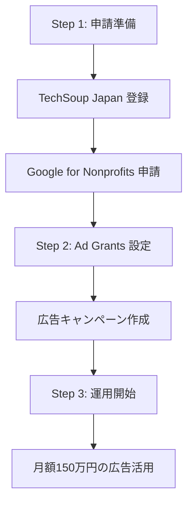
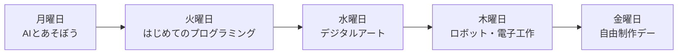
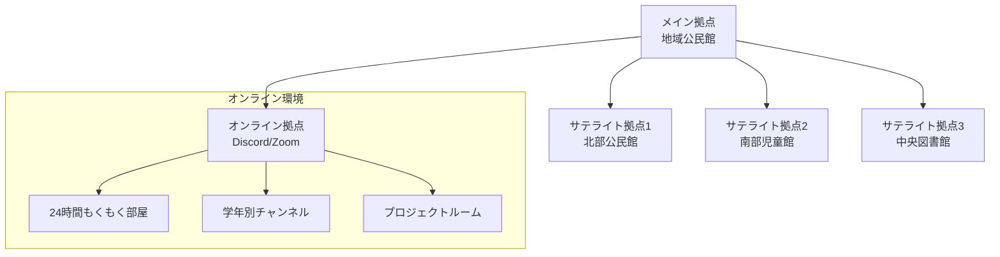
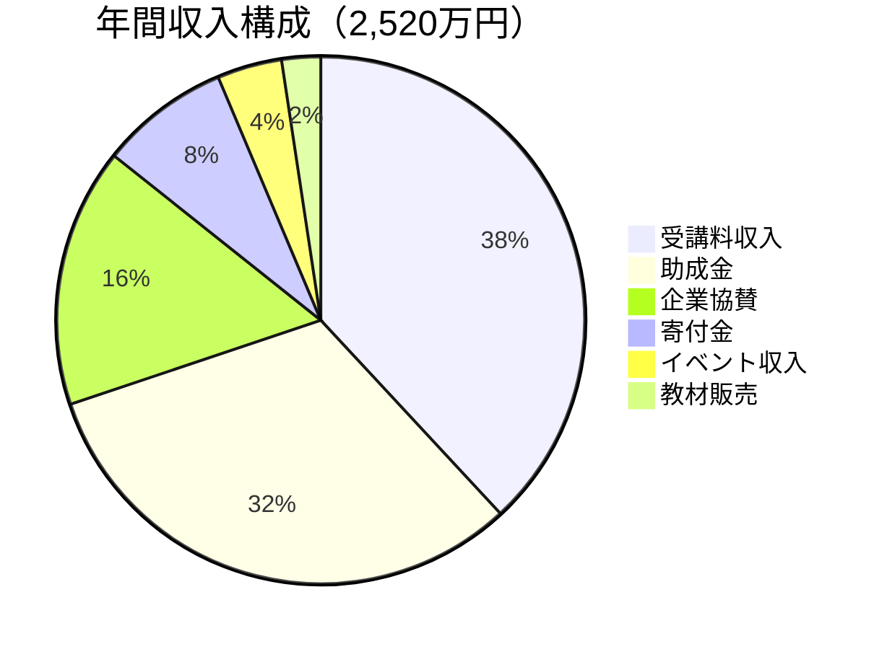

# AI Creator Lab Tokyo 事業企画書

## 📋 目次

1. [立ち上げ30日間アクションプラン](#立ち上げ30日間アクションプラン)
2. [NPO法人向け特別戦略](#npo法人向け特別戦略)
3. [子ども向けデジタル創造スクール](#子ども向けデジタル創造スクール)

---

## 立ち上げ30日間アクションプラン

### 🗓️ Week 1（Day 1-7）: 基盤構築

#### Day 1-2: ビジネス設計

**午前（4時間）**
- [ ] ビジョン・ミッションの文書化
- [ ] ターゲット顧客の明確化（ペルソナ3つ作成）
- [ ] 競合分析シート作成（5社以上）
- [ ] 独自価値提案（USP）の定義

**午後（4時間）**
- [ ] 収支計画Excel作成
  - 初期投資：50万円想定
  - 月間収支シミュレーション
  - 損益分岐点の計算
- [ ] 価格設定の決定

**必要ツール**
- Google Workspace（無料）
- Notion（無料プラン）
- ChatGPT/Claude（企画サポート）

#### Day 3-4: 法的準備とブランディング

**やることリスト**
- [ ] 事業形態の決定
  - 個人事業主として開始 → 法人化は売上1000万円超えてから
- [ ] 屋号の決定と商標調査
- [ ] ドメイン取得（.com/.jp）
  - お名前.com or ムームードメイン（年間1,500円程度）
- [ ] ロゴ作成
  - Canva無料版で作成
  - または Fiverr で5,000円程度で外注

**必要な申請**
- [ ] 開業届の準備（まだ提出しない）
- [ ] 銀行口座の準備（事業用）
- [ ] 会計ソフトの選定（freee or マネーフォワード）

#### Day 5-7: Web基盤構築

**ウェブサイト立ち上げ**
- [ ] プラットフォーム選択
  - 推奨: WordPress.com（月額500円スタート）
  - 代替: Wix, STUDIO, Notion公開ページ

**必須ページ作成**
- [ ] トップページ
- [ ] コース紹介
- [ ] 料金表
- [ ] 講師紹介（自己紹介）
- [ ] お問い合わせフォーム
- [ ] プライバシーポリシー
- [ ] 特定商取引法表記

**SNSアカウント開設**
- [ ] X (Twitter) - @AICreatorLabTokyo
- [ ] Instagram - @ai.creator.lab.tokyo
- [ ] YouTube - AI Creator Lab Tokyo
- [ ] TikTok - @aicreatorlab
- [ ] LinkedIn - 会社ページ
- [ ] 各SNSのプロフィール統一
- [ ] Linktree設定（全SNSリンク集約）

### 🗓️ Week 2（Day 8-14）: コンテンツ制作

#### Day 8-10: カリキュラム詳細設計

**最初の講座：「ChatGPT/Claude 仕事効率化 3日間集中講座」**

| 日程 | 内容 | 時間配分 |
|------|------|----------|
| Day 1: 基礎編 | AIの仕組み アカウント作成 基本操作 演習 | 30分×4セッション （計2時間） |
| Day 2: 実践編 | 文書作成自動化 データ分析 画像生成連携 | 40分×3セッション （計2時間） |
| Day 3: 応用編 | カスタムGPT作成 API連携基礎 業務適用計画 | 40分×3セッション （計2時間） |

**教材作成**
- [ ] Googleスライドでプレゼン作成（各回30枚）
- [ ] 実習用サンプルファイル準備
- [ ] 録画用台本作成
- [ ] 修了証デザイン（Canvaで作成）

#### Day 11-12: 無料コンテンツ制作

**集客用コンテンツ**
- [ ] 無料PDF教材：「AIで仕事を10倍速にする7つの方法」（10ページ）
- [ ] YouTube動画5本撮影
  - ChatGPT基礎（10分）
  - 画像生成AI入門（10分）
  - AI活用事例集（10分）
  - よくある間違い（10分）
  - スクール紹介（5分）
- [ ] ブログ記事3本
  - SEO対策キーワード選定
  - 各2000文字程度

#### Day 13-14: システム構築

**決済システム**
- [ ] Stripe（クレジットカード決済）
- [ ] PayPal（海外対応）
- [ ] 銀行振込対応

**予約システム**
- [ ] Calendly（無料版）または Google Calendar連携

**学習管理システム（LMS）**
- [ ] Google Classroom（無料）またはNotionで受講生ページ作成

**自動化設定**
- [ ] Gmail テンプレート設定・問い合わせ対応フロー
- [ ] Zapier連携（無料版）
  - フォーム → スプレッドシート
  - 申込 → Slack通知

### 🗓️ Week 3（Day 15-21）: マーケティング開始

#### Day 15-16: 無料体験会の準備

**イベント企画**
- [ ] 第1回無料体験会の設定
  - 日時: Day 22（土曜日）14:00-16:00
  - 場所: オンライン（Zoom）
  - 定員: 20名

**イベントページ作成**
- [ ] Peatix
- [ ] connpass
- [ ] Facebook イベント

**体験会の内容（計120分）**
| 時間 | 内容 |
|------|------|
| 10分 | 自己紹介 |
| 60分 | AI活用デモ |
| 30分 | 質疑応答 |
| 20分 | スクール案内 |

#### Day 17-19: PR活動開始

**SNS投稿計画**
| 時間 | 内容 |
|------|------|
| 9:00 | おはようツイート + AI Tips |
| 12:00 | 昼休みに見たい実例紹介 |
| 18:00 | 仕事終わりの学習コンテンツ |
| 21:00 | 明日使えるプロンプト |

- [ ] コンテンツカレンダー作成（1ヶ月分）
  - Notion or Googleカレンダーで管理

**プレスリリース**
- [ ] 無料で始める
  - note記事投稿
  - Qiita技術記事
  - はてなブログ
  - NewsPicksコメント

#### Day 20-21: パートナーシップ構築

**連携先リスト作成と連絡**

**コワーキングスペース**
- [ ] WeWork（1日パス交渉）
- [ ] Fabbit
- [ ] Yahoo! LODGE

**コミュニティ連携**
- [ ] AI系Meetupグループ
- [ ] Facebookグループ参加
- [ ] Discordサーバー参加

**インフルエンサーアプローチ**
- [ ] AI系YouTuber 10名リストアップ
- [ ] DM送信テンプレート作成

### 🗓️ Week 4（Day 22-30）: 実行とフィードバック

#### Day 22: 第1回無料体験会実施

**当日の流れ**
| 時間 | 活動 |
|------|------|
| 13:00 | 最終準備 |
| 13:30 | Zoom開場 |
| 14:00 | 体験会スタート |
| 16:00 | 終了 |
| 16:30 | アンケート送信 |
| 17:00 | 振り返り |

**必要な準備**
- [ ] Zoom有料版（月2,000円）
- [ ] 録画設定
- [ ] アンケートフォーム（Googleフォーム）
- [ ] 参加特典（割引クーポン）

#### Day 23-25: フィードバック反映

**改善アクション**
- [ ] アンケート分析
- [ ] カリキュラム修正
- [ ] 価格調整検討
- [ ] 次回体験会の日程決定

**初期受講生の獲得（目標: 5名）**
- [ ] 体験会参加者へのフォローメール
- [ ] 限定割引オファー（48時間限定）
- [ ] 個別相談会の案内
- [ ] 友達紹介キャンペーン

#### Day 26-28: 本格運営準備

**第1期生向け準備**
- [ ] Slackワークスペース作成
- [ ] 教材の最終確認
- [ ] スケジュール確定
- [ ] 決済処理
- [ ] ウェルカムキット作成
  - 受講ガイド
  - Slack招待
  - カレンダー登録

#### Day 29-30: 次月計画

**スケールアップ計画**
- [ ] 2ヶ月目の目標設定
  - 受講生20名
  - 売上100万円
- [ ] 追加コース開発
- [ ] 講師採用準備
- [ ] 法人営業リスト作成

### 💰 初期投資内訳（最小限ver）

| 項目 | 金額 | 備考 |
|------|------|------|
| ドメイン・サーバー | 5,000円 | 年間 |
| Zoom Pro | 2,000円 | 月額 |
| Canva Pro | 1,500円 | 月額 |
| ChatGPT Plus | 3,000円 | 月額 |
| 広告費 | 30,000円 | Facebook/Google |
| 雑費 | 8,500円 | 名刺等 |
| **合計** | **50,000円** |  |

### 🎯 30日後の成功基準

**最低限達成したい目標**
- ✅ 受講生5名獲得
- ✅ 売上25万円
- ✅ SNSフォロワー合計500名
- ✅ メールリスト100名
- ✅ 体験会2回開催

**できれば達成したい目標**
- 🎯 受講生10名
- 🎯 企業研修1社
- 🎯 メディア掲載1件
- 🎯 講師パートナー1名

### 🚀 今すぐやる3つのこと

**今日中に（30分で）**
1. Xアカウント作成
2. 最初のツイート投稿
3. Notionで計画管理ページ作成

**明日までに（2時間で）**
1. ドメイン取得
2. Canvaでロゴ作成
3. 体験会の日程決定

**今週中に（10時間で）**
1. Webサイト公開
2. 最初の教材作成
3. 無料体験会の告知開始

### 🌟 成功の秘訣

- 完璧を求めない（70%で走り出す）
- 毎日1つは必ず前進する
- フィードバックは即反映
- 最初の1人を大切にする

**困ったら：**
- ChatGPT/Claudeに相談
- 競合の真似から始める
- SNSで質問する
- 小さく始めて大きく育てる

---

## NPO法人向け特別戦略

> NPO法人をお持ちなら、一般的な営利企業では不可能な特典が山ほどあります！

### 🎯 NPO法人の強力な優位性

#### Google Ad Grants 完全攻略法

**基本情報**
- **月額広告費**: $10,000（約150万円）無料
- **年間**: 1,800万円分の広告が無料
- これだけで事業が成立するレベル！

**申請から運用までのステップ**

**Step 1: 申請準備（1週間）**
- [ ] TechSoup Japan で団体確認
  - NPO法人の登記簿謄本
  - 定款のコピー
  - 事業報告書
- [ ] Google for Nonprofits 申請（通常2-14日で承認）

**必要な準備**
- [ ] NPO法人のWebサイト（必須）
- [ ] プライバシーポリシー
- [ ] SSL証明書（https://）
- [ ] 寄付ページ or 問い合わせフォーム

**高価値キーワード戦略**

| キーワード | 月間検索数 | 適用分野 |
|------------|------------|----------|
| "生成AI 学習" | 8,100回 | メインターゲット |
| "ChatGPT 使い方" | 27,100回 | 初心者向け |
| "AI 副業" | 4,400回 | 収益化関心層 |
| "プロンプトエンジニアリング" | 2,900回 | 専門層 |
| "東京 AI スクール" | 720回 | 地域特化 |

### 💻 その他の無料・割引サービス活用

#### Microsoft（非営利団体向け）

**無料で使えるもの**
- [ ] Microsoft 365 Business Premium
  - 通常 月額2,750円 × 10ユーザー = 年間33万円分
- [ ] Azure クレジット: 年間 $3,500（約52万円）
- [ ] GitHub Team: 通常 月額$4/ユーザー
- [ ] LinkedIn Learning: 法人向け学習プラットフォーム

#### Google Workspace for Nonprofits
- [ ] **無料版**: Gmail（カスタムドメイン）、Drive（30GB/ユーザー）、Meet（24時間会議）
- [ ] **割引版（75%OFF）**: Business Standard: 月額680円→170円、100TB共有ストレージ

#### その他のツール
| ツール | 割引率 | 月額節約額 |
|--------|-------|-----------|
| Slack | 85%割引 | 約15,000円 |
| Zoom | 50%割引 | 約1,000円 |
| Canva for Nonprofits | 無料 | 1,500円 |
| Adobe Creative Cloud | 60%割引 | 約4,000円 |
| Salesforce | 10ライセンス無料 | 約15,000円 |

### 💰 助成金・補助金の活用

#### 即申請可能な助成金

**日本財団**
- [ ] 上限: 1,000万円
- [ ] 対象: 教育・人材育成事業
- [ ] 申請時期: 年2回（4月、10月）

**東京都 NPO法人向け助成**
- [ ] 事業費助成: 上限 300万円、補助率 2/3
- [ ] デジタル人材育成が優先分野

**IT・教育特化の助成**
- [ ] **ソフトバンク みらい基金**: IT教育支援 上限500万円
- [ ] **KDDI財団**: 社会的課題解決 上限300万円（ICT活用事業優遇）

### 🤝 企業CSR連携

**アプローチ先企業**

| 分野 | 企業名 | 提供価値 |
|------|--------|----------|
| IT大手 | Google, Microsoft, AWS NTT, ソフトバンク, 楽天 | CSRレポート掲載 社員向け優待 |
| 人材系 | リクルート, パーソル, パソナ | 人材育成連携 |
| 教育系 | ベネッセ, Z会, リソー教育 | 教育ノウハウ共有 |

### 📊 予想される成果（年間）

**財務インパクト**
| 項目 | 金額 | 備考 |
|------|------|------|
| 収入増 | | |
| Google広告効果 | +600万円 | CV率2%想定 |
| 助成金 | +500万円 | 2-3件採択 |
| 企業スポンサー | +300万円 | 5社×60万 |
| コスト削減 | | |
| ソフトウェア | -150万円 | 無料/割引 |
| 広告費 | -1,800万円 | Ad Grants |
| **総効果** | **+2,850万円** |  |

---

## 子ども向けデジタル創造スクール

### 🌟 AI Kids Lab - みらいの創造工房

#### ビジョン・ミッション

**ビジョン**
「すべての子どもたちに、テクノロジーで創造する喜びを」

デジタル格差をなくし、家庭環境に関わらず、すべての子どもたちが最先端技術に触れ、自由に創造できる第三の居場所（サードプレイス）を提供します。

**ミッション**
- 安心・安全な放課後の居場所づくり
- 創造性とテクノロジーの融合教育
- 地域コミュニティの活性化
- 未来を生きる力の育成

### 📊 社会的背景と必要性

**現状の課題**

| 課題 | データ | 影響 |
|------|--------|------|
| デジタル格差 | 世帯年収300万未満の家庭の40%がPC未所有 | 教育機会の不平等 |
| 放課後の居場所不足 | 学童保育待機児童1.6万人 | 共働き家庭の負担 |
| プログラミング教育 | 小学校必修化も教員の70%が指導に不安 | 質のばらつき |
| 創造的活動の減少 | 子どもの自由時間30年で40%減 | 想像力・創造力低下 |

### 🎯 ターゲット層

| 年齢層 | 特徴 | ニーズ | 人数目標 |
|--------|------|--------|----------|
| 小学1-3年生 | 好奇心旺盛、基礎力形成期 | 楽しく学ぶ、友達づくり | 40名 |
| 小学4-6年生 | 論理的思考発達期 | 本格的な制作、発表機会 | 60名 |
| 中学生 | アイデンティティ形成期 | 専門性、進路探索 | 40名 |
| 高校生 | 進路決定期 | 実践的スキル、ポートフォリオ | 20名 |

**特別支援枠**
- ひとり親家庭：全体の30%
- 生活困窮世帯：全体の20%
- 不登校児童：10名程度
- 発達特性のある子：積極受入

### 📚 カリキュラム構成

#### 🐣 ビギナーコース（小1-3年生）

| 曜日 | プログラム | 内容 | 時間 |
|------|------------|------|------|
| 月 | AIとあそぼう | ChatGPTで物語づくり AI画像生成でキャラクター作成 音声AIで歌を作ろう | 16:00-17:00 |
| 火 | はじめてのプログラミング | Scratch Jr. Code.org Viscuit マインクラフト教育版 | 16:00-17:00 |
| 水 | デジタルアート | お絵かきアプリ 簡単3Dモデリング（Tinkercad） アニメーション基礎 | 16:00-17:00 |
| 木 | ロボット・電子工作 | micro:bit LEGO Education 簡単な電子回路 | 16:00-17:00 |
| 金 | 自由制作デー | 好きなことを深める 友達と協力制作 作品発表会 | 16:00-18:00 |

#### 🚀 ジュニアコース（小4-6年生）

| 曜日 | プログラム | 内容 | 時間 |
|------|------------|------|------|
| 月 | AI活用マスター | プロンプトエンジニアリング 画像生成AI（Midjourney体験） 動画制作AI AIプログラミング基礎 | 16:30-18:00 |
| 火 | 本格プログラミング | Scratch → Python移行 Webサイト作成（HTML/CSS） ゲーム開発 アプリ開発入門 | 16:30-18:00 |
| 水 | 3DCG・メタバース | Blender基礎 Roblox Studio VRChat ワールド作成 3Dプリンター活用 | 16:30-18:00 |
| 木 | STEM総合 | Arduino プログラミング ドローン操作・プログラミング IoT工作 データサイエンス入門 | 16:30-18:00 |
| 金 | プロジェクト学習 | チーム開発 問題解決型学習（PBL） 地域課題への取り組み プレゼンテーション | 16:30-18:30 |

#### 💫 アドバンスコース（中高生）

**土曜集中講座（13:00-17:00）**

| 時間帯 | 分野 | 内容 |
|--------|------|------|
| 13:00-15:00 | 専門技術 | 機械学習入門 Web開発（React/Next.js） ゲームエンジン（Unity/Unreal） サイバーセキュリティ基礎 |
| 15:00-17:00 | キャリア開発 | ポートフォリオ作成 インターンシップ準備 起業家精神 大学・専門学校連携 |

### 🏢 運営体制

#### ハイブリッド型拠点

#### スタッフ体制

| 役割 | 人数 | 雇用形態 | 月額費用 |
|------|------|----------|----------|
| 統括責任者 | 1名 | 常勤 | 25万円 |
| 教育コーディネーター | 2名 | 常勤 | 20万円×2 |
| メイン講師 | 3名 | 非常勤 | 10万円×3 |
| 学生メンター | 10名 | ボランティア | 交通費のみ |
| 保護者ボランティア | 20名 | ボランティア | 0円 |

### 💰 料金体系と収支計画

#### 受講料設定（スライディングスケール方式）

| コース | 通常料金 | 低所得世帯 | 生活保護世帯 |
|--------|----------|------------|---------------|
| 週1回コース | 8,000円/月 | 4,000円/月 | 無料 |
| 週2回コース | 14,000円/月 | 7,000円/月 | 1,000円/月 |
| 週3回以上 | 18,000円/月 | 9,000円/月 | 2,000円/月 |
| オンラインのみ | 5,000円/月 | 2,500円/月 | 無料 |

**特別割引**
- 兄弟割引：2人目以降50%OFF
- ひとり親割引：50%OFF
- 早期申込割引：初月無料
- 紹介割引：1ヶ月無料

#### 収支計画（年間）

**収入**
| 項目 | 金額 | 詳細 |
|------|------|------|
| 受講料収入 | 960万円 | 160名×平均5,000円×12ヶ月 |
| 助成金 | 800万円 | 複数助成金採択 |
| 企業協賛 | 400万円 | 10社×40万円 |
| 寄付金 | 200万円 | クラウドファンディング含む |
| イベント収入 | 100万円 | 特別講座・キャンプ |
| 教材販売 | 60万円 | オリジナル教材 |
| **合計** | **2,520万円** |  |

**支出**
| 項目 | 金額 | 詳細 |
|------|------|------|
| 人件費 | 1,320万円 | スタッフ給与 |
| 会場費 | 120万円 | 公民館利用料等 |
| 機材・教材費 | 300万円 | PC、ロボット等 |
| システム費 | 180万円 | クラウド、ソフトウェア |
| 広報費 | 100万円 | Web、チラシ等 |
| 保険料 | 60万円 | 傷害保険等 |
| 予備費 | 120万円 |  |
| **合計** | **2,200万円** |  |
| **収支** | **+320万円** | 次年度拡大資金 |

### 🎁 活用可能な助成金・支援

#### 確実に狙える助成金

**子ども・教育系**

| 助成団体 | 金額 | 対象 | 申請時期 |
|----------|------|------|----------|
| 子どもゆめ基金 | 300万円 | 体験活動・読書活動 | 年2回（5月、11月） |
| ベネッセこども基金 | 100-300万円 | 学び支援活動 | 経済困難家庭重点 |
| 日本財団 子ども第三の居場所 | 最大3,000万円（3年間） | 居場所づくり事業 | 運営費も対象 |

**IT・STEM教育系**

| 助成団体 | 金額 | 対象 |
|----------|------|------|
| ソフトバンク つながる募金 | 500万円 | ICT活用教育 |
| KDDI財団 | 300万円 | 情報通信技術活用 |
| Google.org インパクトチャレンジ | 最大1,000万円 | テクノロジー活用の社会課題解決 |

### 🚀 段階的展開計画

```mermaid
gantt
    title 展開スケジュール
    dateFormat  X
    axisFormat %s

    section Phase 1: パイロット期
    NPO法人準備           :1, 2
    公民館交渉           :2, 3
    基本機材調達         :3, 4
    第1回体験会         :4, 4

    section Phase 2: 本格始動期
    正式開講             :4, 6
    口コミ展開           :5, 6
    助成金申請           :6, 6

    section Phase 3: 安定運営期
    講師チーム拡充       :7, 9
    カリキュラム体系化   :8, 10
    成果発表会           :11, 12
    次年度計画           :12, 12
```

### 📊 成功指標（KPI）

#### 定量指標

| 指標 | 3ヶ月 | 6ヶ月 | 1年後 |
|------|-------|-------|-------|
| 登録生徒数 | 20名 | 60名 | 100名 |
| 継続率 | 80% | 85% | 90% |
| 無料枠比率 | 30% | 30% | 30% |
| ボランティア数 | 5名 | 15名 | 30名 |
| 作品制作数 | 50個 | 200個 | 500個 |

#### 定性指標
- **学習成果**: プログラミング検定合格者、コンテスト入賞、自主制作作品の質
- **社会的インパクト**: 不登校児の居場所、地域コミュニティ活性化、保護者の就労支援
- **子どもの変化**: 自己肯定感向上、創造性・問題解決力、コミュニケーション能力

### 🌟 差別化ポイント

| 項目 | 一般的な教室 | AI Kids Lab |
|------|--------------|-------------|
| 料金 | 1.5-3万円/月 | 0-8,000円/月 |
| アクセス | 都市部中心 | 地域密着+オンライン |
| 内容 | 単一分野 | 総合的な学び |
| 雰囲気 | 教室・塾 | 居場所・遊び場 |
| 講師 | プロ講師のみ | 地域人材活用 |
| 時間 | 固定時間 | フレキシブル |

### 🎯 今すぐ始めるアクション

#### 今週やること

| 日程 | アクション |
|------|------------|
| Day 1-2 | 地域の公民館3ヶ所に電話 使用可能な曜日・時間帯確認 料金交渉 |
| Day 3-4 | 無料体験会のチラシ作成 近隣小学校へ配布依頼 SNSアカウント開設 |
| Day 5-7 | 第1回体験会の内容決定 必要機材リストアップ ボランティア募集開始 |

#### 必要な初期投資（最小限）

| 項目 | 金額 | 調達方法 |
|------|------|----------|
| 中古PC 5台 | 10万円 | リース or 寄贈依頼 |
| 教材ライセンス | 3万円 | 無料版で開始 |
| 保険 | 2万円 | 必須 |
| 広報費 | 5万円 | チラシ、Web |
| **合計** | **20万円** | クラウドファンディング |

---

## 📝 まとめ

このモデルなら、子どもたちの未来を創りながら、地域に愛される持続可能な事業として成長できます。

**NPO×公民館×オンラインの組み合わせで、日本中どこでも展開可能なモデルです！**

頑張ってください！🌈